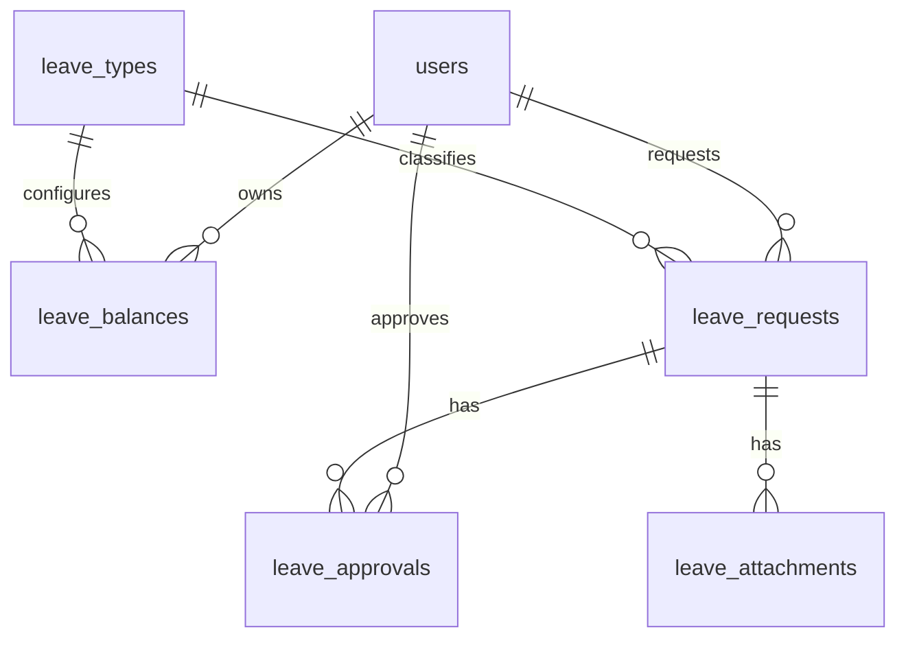

# Leave Management Design

Phase 1.2 prepared the database model for Leave Management.

Phase 2 starts the Leave Management API, Thai frontend pages, attachment upload, and a basic approval workflow.

## Tables

```text
leave_types
leave_balances
leave_requests
leave_attachments
leave_approvals
```

## Relationships



## Leave Types

Initial supported leave types:

- Annual Leave
- Sick Leave
- Personal Leave
- Maternity Leave
- Custom leave types through future admin configuration

## Status Design

Recommended future request status values:

- Draft
- Submitted
- Pending
- Approved
- Rejected
- Cancelled

## Implemented Phase 2 Foundation

- Leave type management
- Leave request draft, submit, cancel, approve, and reject
- Leave attachment upload
- Leave balance summary
- Approval log records
- LINE notification placeholder

## Next Implementation Step

Add configurable multi-step approval chains, balance adjustment tools, attachment download controls, and real LINE Messaging integration.
