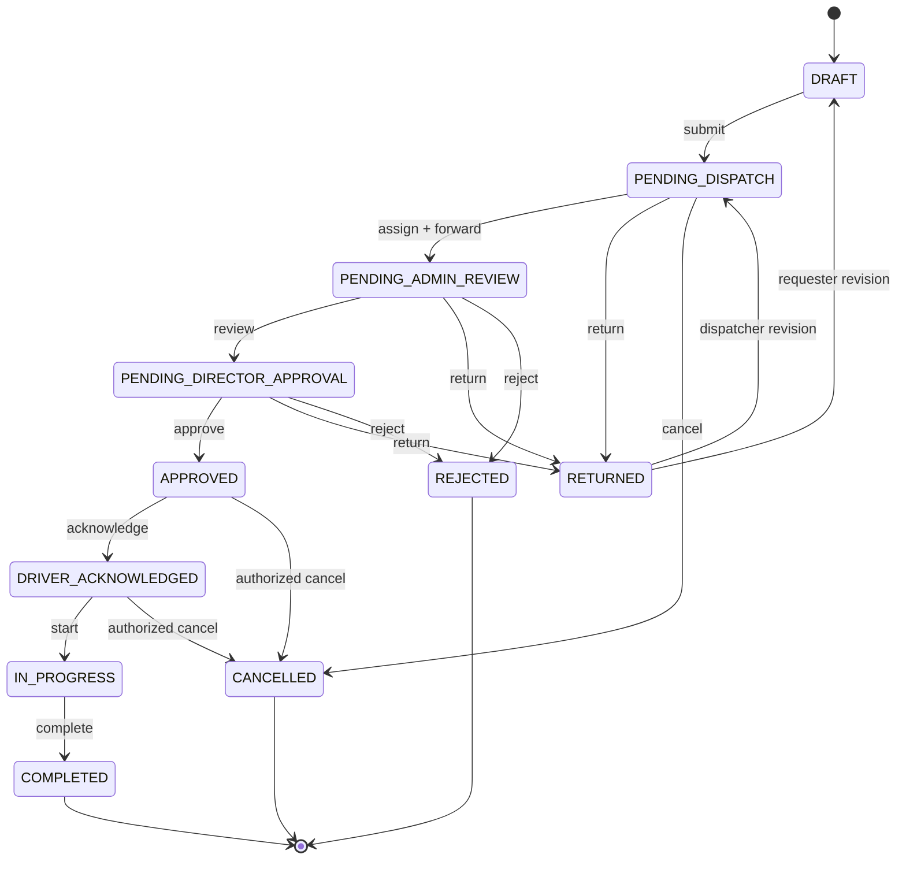

# HOP Vehicle State Diagram

```mermaid
stateDiagram-v2
    [*] --> DRAFT
    DRAFT --> PENDING_DISPATCH: submit
    PENDING_DISPATCH --> PENDING_ADMIN_REVIEW: assign + forward
    PENDING_DISPATCH --> RETURNED: return
    PENDING_ADMIN_REVIEW --> PENDING_DIRECTOR_APPROVAL: review
    PENDING_ADMIN_REVIEW --> RETURNED: return
    PENDING_ADMIN_REVIEW --> REJECTED: reject
    PENDING_DIRECTOR_APPROVAL --> APPROVED: approve
    PENDING_DIRECTOR_APPROVAL --> RETURNED: return
    PENDING_DIRECTOR_APPROVAL --> REJECTED: reject
    RETURNED --> DRAFT: requester revision
    RETURNED --> PENDING_DISPATCH: dispatcher revision
    APPROVED --> DRIVER_ACKNOWLEDGED: acknowledge
    DRIVER_ACKNOWLEDGED --> IN_PROGRESS: start
    IN_PROGRESS --> COMPLETED: complete
    PENDING_DISPATCH --> CANCELLED: cancel
    APPROVED --> CANCELLED: authorized cancel
    DRIVER_ACKNOWLEDGED --> CANCELLED: authorized cancel
    COMPLETED --> [*]
    REJECTED --> [*]
    CANCELLED --> [*]
```

`ReturnTarget` ต้องถูกเก็บพร้อม return action เพื่อเลือกเส้นทางออกจาก `RETURNED` อย่างชัดเจน
