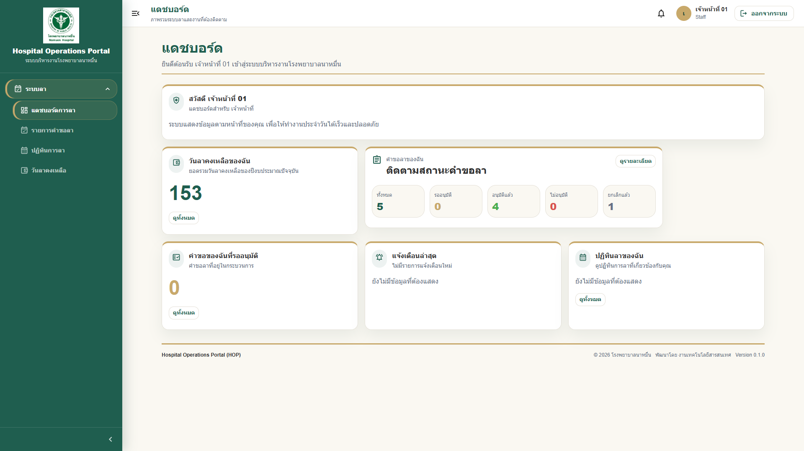
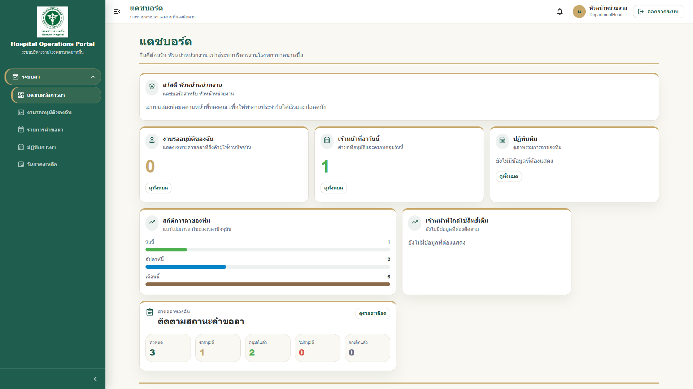

# 02 - คู่มือการใช้งาน Dashboard

## สารบัญ

1. [ภาพรวม Dashboard](#ภาพรวม-dashboard)
2. [การดูข้อมูลสรุป](#การดูข้อมูลสรุป)
3. [การอ่าน Card KPI](#การอ่าน-card-kpi)
4. [การดูงานรออนุมัติ](#การดูงานรออนุมัติ)
5. [การดูสถานะคำขอลา](#การดูสถานะคำขอลา)
6. [ตัวอย่างสถานะที่พบได้](#ตัวอย่างสถานะที่พบได้)
7. [Dashboard สำหรับหัวหน้าหน่วยงาน](#dashboard-สำหรับหัวหน้าหน่วยงาน)
8. [ข้อควรทราบ](#ข้อควรทราบ)

## ภาพรวม Dashboard

Dashboard คือหน้าแรกที่ผู้ใช้งานเห็นหลังเข้าสู่ระบบ ใช้สำหรับดูข้อมูลสรุป งานที่ต้องดำเนินการ และสถานะสำคัญตามสิทธิ์ของผู้ใช้งานแต่ละคน

Dashboard อาจแสดงข้อมูลแตกต่างกันตามบทบาท เช่น:

| บทบาท | ข้อมูลที่อาจเห็น |
|---|---|
| ผู้ใช้งานทั่วไป | คำขอลาของฉัน, วันลาคงเหลือ, สถานะคำขอ |
| หัวหน้างาน | คำขอลาของฉันที่รออนุมัติ, คำขอลาของหน่วยงาน, งานรออนุมัติ, ลูกทีมลาวันนี้, สถิติทีม |
| HR | ภาพรวมคำขอลา, วันหยุด, ยอดวันลา |
| ผู้ดูแลระบบ | ผู้ใช้งาน, หน่วยงาน, Audit Log, สถานะระบบ |
| ผู้บริหาร | ภาพรวมการลาและข้อมูลประกอบการตัดสินใจ |

> **Note:** หาก Dashboard ของท่านไม่เหมือนกับตัวอย่าง อาจเกิดจากสิทธิ์การใช้งานที่แตกต่างกัน

## การดูข้อมูลสรุป

1. Login เข้าระบบ HOP
2. ระบบจะแสดงหน้า Dashboard อัตโนมัติ
3. ดู Card หรือกล่องข้อมูลที่แสดงบนหน้า
4. คลิก Card ที่ต้องการดูรายละเอียด หากระบบรองรับ
5. หากข้อมูลไม่อัปเดต ให้กด refresh

ตัวอย่าง:

เจ้าหน้าที่ทั่วไปอาจเห็น Card `คำขอลาของฉัน` และ `วันลาคงเหลือ` ส่วนหัวหน้างานจะเห็นข้อมูลเรียงจากงานส่วนตัวไปยังงานของทีม เช่น `คำขอลาของฉันที่รออนุมัติ` และ `คำขอลาของหน่วยงาน`

## การอ่าน Card KPI

Card KPI คือกล่องข้อมูลสรุป เช่น จำนวนรายการ ร้อยละ หรือสถานะสำคัญ

| Card | ความหมาย |
|---|---|
| คำขอรออนุมัติ | จำนวนคำขอที่รอผู้ใช้งานดำเนินการ |
| คำขอลาของฉัน | จำนวนคำขอลาที่ผู้ใช้งานสร้างไว้ |
| คำขอลาของฉันที่รออนุมัติ | คำขอของผู้ใช้งานเองที่ยังอยู่ในกระบวนการอนุมัติ |
| คำขอลาของหน่วยงาน | คำขอของเจ้าหน้าที่ในหน่วยงานเดียวกัน โดยไม่รวมคำขอของหัวหน้าคนนั้นเอง |
| อนุมัติแล้ว | จำนวนคำขอที่อนุมัติเรียบร้อย |
| ไม่อนุมัติ | จำนวนคำขอที่ถูกปฏิเสธ |
| เจ้าหน้าที่ลาวันนี้ | จำนวนเจ้าหน้าที่ที่มีการลาในวันปัจจุบัน |

> **Tip:** Card KPI เป็นข้อมูลสรุป หากต้องการดูรายละเอียดให้คลิกไปยังหน้ารายการที่เกี่ยวข้อง

## การดูงานรออนุมัติ

สำหรับหัวหน้างานหรือผู้อนุมัติ:

1. ดู Card `งานรออนุมัติของฉัน`
2. หากตัวเลขมากกว่า 0 ให้คลิก `ดูทั้งหมด`
3. ระบบจะพาไปหน้ารายการรออนุมัติ
4. คลิกคำขอเพื่อดูรายละเอียด
5. ตรวจสอบข้อมูลก่อนอนุมัติหรือไม่อนุมัติ

> **Warning:** ระบบจะแสดงเฉพาะงานที่ถึงคิวของท่าน ไม่ควรอนุมัติแทนผู้อื่นหากไม่ได้รับมอบหมายตามสิทธิ์

## การดูสถานะคำขอลา

ผู้ใช้งานทั่วไปสามารถดูสถานะคำขอลาของตนเองได้จาก Dashboard หรือเมนูรายการคำขอลา

1. ไปที่ Card หรือเมนู `รายการคำขอลา`
2. ดูสถานะของคำขอแต่ละรายการ
3. คลิกคำขอเพื่อดูรายละเอียด
4. ตรวจสอบ timeline การอนุมัติ

## ตัวอย่างสถานะที่พบได้

| สถานะ | ความหมาย | สิ่งที่ควรทำ |
|---|---|---|
| แบบร่าง | ยังไม่ได้ส่งคำขอ | ตรวจสอบและกดส่งคำขอ |
| รออนุมัติ | ส่งคำขอแล้ว รอผู้อนุมัติ | รอติดตามสถานะ |
| อนุมัติแล้ว | คำขอผ่านการอนุมัติครบ | สามารถดาวน์โหลด PDF ได้ |
| ไม่อนุมัติ | คำขอถูกปฏิเสธ | อ่านเหตุผลและติดต่อผู้เกี่ยวข้องหากจำเป็น |
| ยกเลิกแล้ว | คำขอถูกยกเลิก | ไม่ต้องดำเนินการต่อ |

## Dashboard สำหรับหัวหน้าหน่วยงาน

Dashboard ของหัวหน้าหน่วยงานถูกออกแบบให้แยกข้อมูล 2 กลุ่ม เพื่อไม่ให้คำขอของหัวหน้าเองปะปนกับคำขอของลูกทีม

### คำขอลาของฉันที่รออนุมัติ

Card นี้แสดงเฉพาะคำขอลาของหัวหน้าเองที่อยู่ในสถานะ `รออนุมัติ`

1. เปิด `Dashboard ระบบลา`
2. ดู Card `คำขอลาของฉันที่รออนุมัติ`
3. กด `ดูทั้งหมด`
4. ระบบจะเปิดหน้า `รายการคำขอลา` พร้อมตัวกรอง `คำขอของฉัน` และสถานะ `รออนุมัติ`

### คำขอลาของหน่วยงาน

Card นี้แสดงคำขอของเจ้าหน้าที่ในหน่วยงานเดียวกัน โดยไม่รวมคำขอของหัวหน้าเอง

1. เปิด `Dashboard ระบบลา`
2. ดู Card `คำขอลาของหน่วยงาน`
3. กด `ดูทั้งหมด`
4. ระบบจะเปิดหน้า `รายการคำขอลา` พร้อมตัวกรอง `คำขอของหน่วยงาน`

> **Note:** หากหัวหน้าไม่มีหน่วยงานหรือไม่มีสิทธิ์ดูข้อมูลหน่วยงาน ระบบจะแสดงรายการว่างหรือไม่แสดงตัวเลือกตามสิทธิ์

## ข้อควรทราบ

1. Dashboard แสดงข้อมูลตามสิทธิ์ของผู้ใช้งาน
2. ข้อมูลบางส่วนอาจใช้เวลาสั้น ๆ ในการอัปเดตหลังมีการเปลี่ยนแปลง
3. หากไม่เห็นข้อมูลที่ควรเห็น ให้ตรวจสอบสิทธิ์กับผู้ดูแลระบบ
4. หากพบข้อมูลผิดปกติ ให้บันทึกภาพหน้าจอและแจ้ง IT

---

เอกสารนี้เป็นส่วนหนึ่งของโครงการ Hospital Operations Portal (HOP) โรงพยาบาลนาหมื่น
