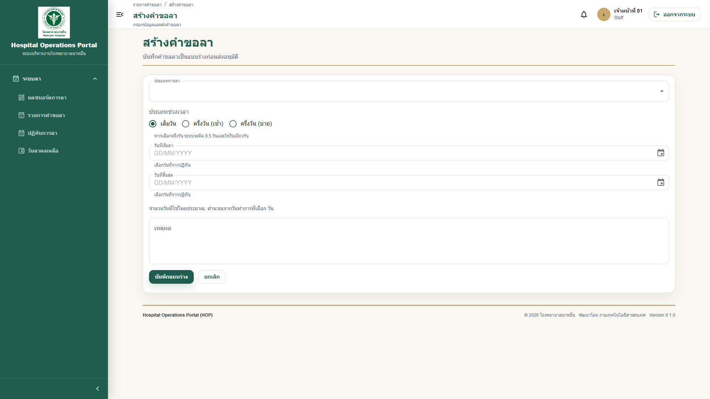

# 03 - คู่มือการใช้งานระบบลา

## สารบัญ

1. [ภาพรวมระบบลา](#ภาพรวมระบบลา)
2. [ประเภทการลา](#ประเภทการลา)
3. [เงื่อนไขการลาเบื้องต้น](#เงื่อนไขการลาเบื้องต้น)
4. [วิธีสร้างคำขอลา](#วิธีสร้างคำขอลา)
5. [วิธีเลือกวันที่ลา](#วิธีเลือกวันที่ลา)
6. [วิธีแนบไฟล์](#วิธีแนบไฟล์)
7. [วิธีดูตัวอย่างไฟล์แนบ](#วิธีดูตัวอย่างไฟล์แนบ)
8. [Checklist ก่อนส่งคำขอลา](#checklist-ก่อนส่งคำขอลา)
9. [วิธีส่งคำขออนุมัติ](#วิธีส่งคำขออนุมัติ)
10. [วิธีติดตามสถานะ](#วิธีติดตามสถานะ)
11. [การใช้ตัวกรองรายการคำขอลา](#การใช้ตัวกรองรายการคำขอลา)
12. [วิธีแก้ไขคำขอที่ถูกตีกลับรอแก้ไข](#วิธีแก้ไขคำขอที่ถูกตีกลับรอแก้ไข)
13. [วิธียกเลิกคำขอ](#วิธียกเลิกคำขอ)
14. [วิธีขอยกเลิกใบลาที่อนุมัติแล้ว](#วิธีขอยกเลิกใบลาที่อนุมัติแล้ว)
15. [วิธีดาวน์โหลด PDF ใบลา](#วิธีดาวน์โหลด-pdf-ใบลา)
16. [คำอธิบายสถานะ](#คำอธิบายสถานะ)
17. [ตัวอย่างปัญหาที่พบบ่อย](#ตัวอย่างปัญหาที่พบบ่อย)

## ภาพรวมระบบลา

ระบบลาใน HOP ใช้สำหรับสร้างคำขอลา ส่งคำขออนุมัติ ติดตามสถานะ และดาวน์โหลดเอกสารใบลาในรูปแบบ PDF โดยระบบจะช่วยตรวจสอบวันลาคงเหลือ วันหยุดราชการ วันเสาร์-อาทิตย์ และเงื่อนไขสิทธิ์เบื้องต้น

ตัวอย่างสถานการณ์:

เจ้าหน้าที่ 01 ต้องการลาพักผ่อน 2 วัน สามารถสร้างคำขอในระบบ แนบเอกสารหากจำเป็น ส่งคำขอ และติดตามได้ว่าขณะนี้รอหัวหน้างานหรือผู้อำนวยการอนุมัติ

## ประเภทการลา

ประเภทการลาอาจแตกต่างตามนโยบายของโรงพยาบาล โดยทั่วไปในระบบอาจมีประเภทดังนี้:

| ประเภทลา | คำอธิบาย |
|---|---|
| ลาพักผ่อน | การลาตามสิทธิ์พักผ่อนประจำปี |
| ลาป่วย | การลาป่วยตามสิทธิ์ |
| ลากิจส่วนตัว | การลาหยุดเพื่อกิจธุระส่วนตัว |
| ลาคลอดบุตร | การลาคลอดตามเงื่อนไขของบุคลากร |
| ลาบวช | การลาอุปสมบทตามเงื่อนไขของบุคลากร |
| อื่น ๆ | ประเภทลาตามที่โรงพยาบาลกำหนด |

> **Note:** ระบบอาจซ่อนประเภทลาที่ผู้ใช้งานไม่มีสิทธิ์เลือก เช่น ประเภทลาที่ไม่ตรงกับเงื่อนไขบุคลากร

## เงื่อนไขการลาเบื้องต้น

1. ต้องมีบัญชีผู้ใช้งานที่เปิดใช้งานอยู่
2. ต้องมีสิทธิ์สร้างคำขอลา
3. ต้องเลือกประเภทลา วันที่ลา และเหตุผลให้ครบถ้วน
4. ระบบจะตรวจสอบวันลาคงเหลือก่อนส่งคำขอ
5. วันหยุดราชการและวันเสาร์-อาทิตย์อาจไม่ถูกนับเป็นวันลา ตามนโยบายระบบ
6. การลาครึ่งวันต้องเลือกวันเริ่มต้นและวันสิ้นสุดเป็นวันเดียวกัน
7. ระบบตรวจเงื่อนไขตามประเภทบุคลากร เช่น ข้าราชการ ลูกจ้างประจำ พนักงานราชการ พนักงานกระทรวงสาธารณสุข และลูกจ้างชั่วคราว
8. กฎอายุงาน 6 เดือนใช้กับ `ลาพักผ่อน` เท่านั้น ประเภทลาอื่นใช้เงื่อนไขเฉพาะของประเภทลานั้น

> **Warning:** หากวันลาคงเหลือไม่เพียงพอ ระบบจะไม่อนุญาตให้ส่งคำขออนุมัติ

> **Note:** หากระบบแสดงข้อความว่าเป็นสิทธิ์ไม่ได้รับค่าจ้าง ให้ตรวจสอบกับ HR ก่อนส่งคำขอ โดยระบบยังบันทึก note/warning จาก policy ไว้ให้ผู้อนุมัติพิจารณา

## วิธีสร้างคำขอลา

1. Login เข้าระบบ HOP
2. ไปที่เมนู `ระบบลา`
3. เลือก `รายการคำขอลา`
4. กดปุ่ม `เพิ่มคำขอลา` หรือ `สร้างคำขอลา`
5. เลือกประเภทการลา
6. เลือกวันที่เริ่มลาและวันที่สิ้นสุด
7. เลือกช่วงเวลา เช่น เต็มวัน ครึ่งวันเช้า หรือครึ่งวันบ่าย
8. กรอกเหตุผลการลา
9. แนบไฟล์ หากจำเป็น
10. กด `บันทึก` เพื่อสร้างแบบร่าง

> **Tip:** หากยังไม่แน่ใจข้อมูล สามารถบันทึกเป็นแบบร่างก่อน แล้วกลับมาแก้ไขภายหลังได้

## วิธีเลือกวันที่ลา

1. คลิกช่อง `วันที่เริ่มลา`
2. เลือกวันที่จากปฏิทิน
3. คลิกช่อง `วันที่สิ้นสุด`
4. เลือกวันที่สิ้นสุด
5. ตรวจสอบจำนวนวันที่ระบบคำนวณให้
6. หากเลือกวันหยุดราชการหรือวันเสาร์-อาทิตย์ ระบบอาจแจ้งเตือนหรือไม่ให้นับเป็นวันลา

ตัวอย่าง:

หากต้องการลาพักผ่อนวันที่ 20-21 มิถุนายน 2569 ให้เลือกวันที่เริ่มเป็น 20/06/2569 และวันที่สิ้นสุดเป็น 21/06/2569

> **Warning:** ห้ามกรอกวันที่เองแบบไม่ตรงรูปแบบ ให้เลือกจาก Date Picker ที่ระบบกำหนด

## วิธีแนบไฟล์

1. ที่หน้าคำขอลา ให้ดูส่วน `ไฟล์แนบ`
2. กดปุ่ม `อัปโหลดไฟล์` หรือ `เลือกไฟล์`
3. เลือกไฟล์จากเครื่องคอมพิวเตอร์
4. ตรวจสอบชื่อไฟล์หลังอัปโหลด
5. หากแนบผิด ให้ลบและอัปโหลดใหม่

[ใส่รูปภาพ: ส่วนไฟล์แนบในหน้าคำขอลา]

ตัวอย่างเอกสารแนบ:

- ใบรับรองแพทย์
- หนังสือเชิญอบรม
- เอกสารประกอบการลาอื่น ๆ

> **Note:** ขนาดไฟล์และประเภทไฟล์ที่รองรับขึ้นอยู่กับการตั้งค่าของระบบ หากแนบไม่ได้ ให้ติดต่อ HR หรือ IT

## วิธีดูตัวอย่างไฟล์แนบ

1. เปิดหน้ารายละเอียดคำขอลา
2. ไปที่ส่วน `ไฟล์แนบ`
3. กดปุ่ม `ดูตัวอย่าง`
4. ระบบจะแสดงไฟล์ในหน้าต่าง Preview
5. หากต้องการเก็บไฟล์ไว้ ให้กด `ดาวน์โหลด` ตามสิทธิ์ที่ระบบอนุญาต

ไฟล์ที่รองรับการดูตัวอย่าง:

| ประเภทไฟล์ | ตัวอย่าง |
|---|---|
| PDF | ใบรับรองแพทย์.pdf |
| JPG/JPEG | รูปภาพเอกสาร.jpg |
| PNG | รูปภาพเอกสาร.png |
| WEBP | รูปภาพเอกสาร.webp |

> **Note:** หากระบบแสดงข้อความ `ไม่รองรับการแสดงตัวอย่างไฟล์ประเภทนี้` ให้ใช้ปุ่มดาวน์โหลด หรือเปลี่ยนไฟล์เป็น PDF/JPG/PNG/WEBP ก่อนอัปโหลดใหม่

> **Tip:** ผู้ขอสามารถอัปโหลด ลบ หรือเปลี่ยนไฟล์แนบได้เฉพาะสถานะ `แบบร่าง` และ `ตีกลับรอแก้ไข` เท่านั้น

## Checklist ก่อนส่งคำขอลา

- [ ] เลือกประเภทลาให้ถูกต้อง
- [ ] เลือกวันที่เริ่มลาและวันที่สิ้นสุดถูกต้อง
- [ ] ตรวจสอบจำนวนวันลา
- [ ] ตรวจสอบช่วงเวลา เต็มวัน/ครึ่งวัน
- [ ] กรอกเหตุผลชัดเจน
- [ ] แนบเอกสารที่จำเป็นแล้ว
- [ ] ตรวจสอบวันลาคงเหลือ
- [ ] อ่านข้อความเตือนจาก policy เช่น อายุงานยังไม่ครบ หรือสิทธิ์ไม่ได้รับค่าจ้าง
- [ ] ตรวจสอบว่าคำขอไม่ตรงกับวันหยุดที่ไม่สามารถลาได้

## วิธีส่งคำขออนุมัติ

1. เปิดคำขอลาที่ต้องการส่ง
2. ตรวจสอบข้อมูลทุกส่วน
3. กดปุ่ม `ส่งคำขอ`
4. ระบบจะเปลี่ยนสถานะเป็น `รออนุมัติ`
5. ระบบจะแจ้งเตือนไปยังผู้อนุมัติที่ถึงคิว

> **Warning:** หลังส่งคำขอแล้ว บางข้อมูลอาจไม่สามารถแก้ไขได้ หากต้องการแก้ไขให้ตรวจสอบสถานะหรือยกเลิกคำขอแล้วสร้างใหม่ตามนโยบาย

## วิธีติดตามสถานะ

1. ไปที่เมนู `รายการคำขอลา`
2. ดูสถานะในตาราง
3. คลิกคำขอที่ต้องการดูรายละเอียด
4. ดูส่วน `สถานะเอกสาร`
5. ดู `สายอนุมัติ` หรือ timeline ว่ารอใครดำเนินการ

[ใส่รูปภาพ: หน้ารายละเอียดคำขอลาและสายอนุมัติ]

ตัวอย่างข้อความ:

- รออนุมัติจากหัวหน้าหน่วยงาน
- รออนุมัติจากผู้อำนวยการ
- อนุมัติแล้ว
- ไม่อนุมัติ
- ตีกลับรอแก้ไข

## การใช้ตัวกรองรายการคำขอลา

หน้า `รายการคำขอลา` มีตัวกรองสำหรับช่วยค้นหารายการจำนวนมาก

1. ไปที่เมนู `ระบบลา`
2. เลือก `รายการคำขอลา`
3. เลือก `ขอบเขตรายการ`
   - `ตามสิทธิ์ของฉัน` แสดงรายการตามสิทธิ์ที่ระบบอนุญาต
   - `คำขอของฉัน` แสดงเฉพาะคำขอที่ตนเองสร้าง
   - `คำขอของหน่วยงาน` แสดงเฉพาะเจ้าหน้าที่ในหน่วยงานเดียวกัน สำหรับผู้มีสิทธิ์ เช่น หัวหน้าหน่วยงาน
4. เลือก `สถานะคำขอ` เช่น `รออนุมัติ`, `ตีกลับรอแก้ไข`, `อนุมัติแล้ว`
5. เลือกประเภทลา วันที่ หรือผู้ขอเพิ่มเติมตามต้องการ

ตัวอย่างการใช้งาน:

| ต้องการดู | วิธีเลือกตัวกรอง |
|---|---|
| คำขอของตนเองที่รออนุมัติ | ขอบเขต `คำขอของฉัน` และสถานะ `รออนุมัติ` |
| คำขอของทีมทั้งหมด | ขอบเขต `คำขอของหน่วยงาน` |
| คำขอที่ถูกตีกลับ | สถานะ `ตีกลับรอแก้ไข` |

> **Note:** ระบบตรวจสิทธิ์ที่ backend เสมอ หากไม่มีสิทธิ์ดูข้อมูลหน่วยงาน แม้เปลี่ยน URL เองก็ไม่สามารถดูข้อมูลเกินสิทธิ์ได้

## วิธีแก้ไขคำขอที่ถูกตีกลับรอแก้ไข

เมื่อผู้อนุมัติต้องการข้อมูลหรือเอกสารเพิ่มเติม ระบบจะแสดงสถานะ `ตีกลับรอแก้ไข`

1. เปิดคำขอจากเมนู `รายการคำขอลา`
2. อ่านเหตุผลที่ผู้อนุมัติระบุ
3. กด `แก้ไขคำขอ`
4. แก้ไขข้อมูลที่จำเป็น
5. อัปโหลด ลบ หรือเปลี่ยนไฟล์แนบ หากผู้อนุมัติร้องขอ
6. ตรวจสอบข้อมูลอีกครั้ง
7. กด `ส่งคำขอใหม่`

> **Warning:** ผู้อนุมัติหรือผู้ดูแลระบบไม่สามารถส่งคำขอใหม่แทนผู้ขอได้ ผู้ขอต้องเป็นผู้กด `ส่งคำขอใหม่` ด้วยตนเอง

## วิธียกเลิกคำขอ

1. เปิดคำขอลาที่ต้องการยกเลิก
2. ตรวจสอบว่าสถานะยังสามารถยกเลิกได้
3. กดปุ่ม `ยกเลิกคำขอ`
4. ยืนยันการยกเลิก
5. ระบบจะเปลี่ยนสถานะเป็น `ยกเลิกแล้ว`

> **Note:** หากคำขออนุมัติครบแล้ว อาจไม่สามารถยกเลิกผ่านระบบได้ ต้องติดต่อ HR ตามระเบียบของโรงพยาบาล

## วิธีขอยกเลิกใบลาที่อนุมัติแล้ว

ใช้สำหรับใบลาที่อนุมัติแล้ว แต่ภายหลังผู้ขอต้องการยกเลิกใบลารายการนั้นและคืนยอดวันลาเข้าระบบ

1. ไปที่เมนู `ระบบลา`
2. เลือก `คำขอยกเลิกใบลา`
3. กดปุ่ม `เลือกใบลาที่ต้องการยกเลิก`
4. เลือกใบลาเดิมของตนเองจาก dropdown
5. ตรวจสอบเลขที่คำขอเดิม ประเภทลา วันที่ลา และจำนวนวันที่จะคืนยอด
6. กรอกเหตุผลการขอยกเลิกใบลา
7. กด `ส่งคำขอ`
8. ติดตามสถานะจากหน้า `คำขอยกเลิกใบลา`

> **Note:** ระบบจะคืนยอดวันลาให้หลังจากคำขอยกเลิกใบลาได้รับการอนุมัติครบทุกขั้นแล้วเท่านั้น

> **Tip:** หากใบลาเดิมถูกยกเลิกหลังอนุมัติแล้ว หน้ารายละเอียดใบลาเดิมจะแสดง banner พร้อมลิงก์ไปยังคำขอยกเลิกใบลา `LVC-xxxx`

### การค้นหาและกรองคำขอยกเลิกใบลา

หน้า `คำขอยกเลิกใบลา` ใช้รูปแบบเดียวกับหน้า `รายการคำขอลา` และมีตัวกรองสำหรับค้นหารายการจำนวนมาก

1. ไปที่เมนู `ระบบลา`
2. เลือก `คำขอยกเลิกใบลา`
3. เลือก `ประเภทลา` หากต้องการดูเฉพาะประเภทใดประเภทหนึ่ง
4. เลือก `สถานะคำขอ` เช่น `รออนุมัติ`, `อนุมัติแล้ว`, `ไม่อนุมัติ`, `ตีกลับ`
5. เลือก `ขอบเขตรายการ` เช่น `คำขอของฉัน` หรือรายการตามสิทธิ์
6. เลือก `ผู้ขอลา` หากมีสิทธิ์ดูหลายคน
7. เลือกช่วงวันที่ `ตั้งแต่วันที่` และ `ถึงวันที่`
8. ใช้ paging ด้านล่างตารางเพื่อเปลี่ยนหน้า หรือเลือกจำนวนรายการต่อหน้า

> **Note:** ตัวกรองไม่เพิ่มสิทธิ์การมองเห็น ระบบยังแสดงเฉพาะรายการที่ผู้ใช้งานมีสิทธิ์ดูเท่านั้น

## วิธีดาวน์โหลด PDF ใบลา

1. เปิดหน้ารายละเอียดคำขอลา
2. กดปุ่ม `ดาวน์โหลด PDF` หรือ `ดาวน์โหลดแบบฟอร์มใบลา`
3. รอระบบสร้างไฟล์
4. เปิดไฟล์ PDF เพื่อตรวจสอบ
5. บันทึกหรือพิมพ์เอกสารตามความจำเป็น

[ใส่รูปภาพ: ปุ่มดาวน์โหลด PDF ใบลา]

> **Tip:** หาก PDF ภาษาไทยแสดงผิดปกติ ให้แจ้ง IT พร้อมแนบไฟล์ตัวอย่างหรือภาพหน้าจอ

## คำอธิบายสถานะ

| สถานะภาษาอังกฤษ | สถานะภาษาไทย | ความหมาย |
|---|---|---|
| Draft | แบบร่าง | สร้างคำขอแล้วแต่ยังไม่ส่ง |
| Pending | รออนุมัติ | ส่งคำขอแล้ว อยู่ระหว่างรอผู้อนุมัติ |
| ReturnedForRevision | ตีกลับรอแก้ไข | ผู้อนุมัติส่งกลับให้ผู้ขอแก้ไขข้อมูลหรือไฟล์แนบ |
| Approved | อนุมัติแล้ว | คำขอได้รับการอนุมัติครบขั้นตอน |
| Rejected | ไม่อนุมัติ | คำขอถูกปฏิเสธ |
| Cancelled | ยกเลิกแล้ว | ผู้ใช้หรือผู้เกี่ยวข้องยกเลิกคำขอ |
| CancelledAfterApproval | ยกเลิกหลังอนุมัติ | ใบลาเดิมถูกยกเลิกจากคำขอยกเลิกใบลาที่อนุมัติครบแล้ว |

## ตัวอย่างปัญหาที่พบบ่อย

| ปัญหา | สาเหตุที่เป็นไปได้ | แนวทางแก้ไข |
|---|---|---|
| ส่งคำขอไม่ได้ | วันลาคงเหลือไม่พอ | ตรวจวันลาคงเหลือหรือปรึกษา HR |
| เลือกวันไม่ได้ | เป็นวันหยุดหรือรูปแบบวันที่ไม่ถูกต้อง | เลือกวันที่จากปฏิทินใหม่ |
| ไม่เห็นปุ่มส่งคำขอ | คำขออยู่สถานะที่ส่งไม่ได้หรือไม่มีสิทธิ์ | ตรวจสถานะหรือแจ้งผู้ดูแลระบบ |
| แนบไฟล์ไม่ได้ | ไฟล์ใหญ่เกินหรือประเภทไฟล์ไม่รองรับ | ลดขนาดไฟล์หรือเปลี่ยนชนิดไฟล์ |
| ดูตัวอย่างไฟล์แนบไม่ได้ | ประเภทไฟล์ไม่รองรับ preview | ใช้ PDF/JPG/PNG/WEBP หรือดาวน์โหลดตามสิทธิ์ |
| คำขอถูกตีกลับรอแก้ไข | ข้อมูลหรือเอกสารยังไม่ครบ | อ่านเหตุผล แก้ไข แล้วกดส่งคำขอใหม่ |
| ไม่เห็นคำขอของตนเอง | ตัวกรองไม่ถูกต้อง | ล้างตัวกรองแล้วค้นหาใหม่ |
| หัวหน้าเห็นคำขอของตนเองปนกับทีม | ใช้ตัวกรองไม่ตรงขอบเขต | เลือก `คำขอของฉัน` หรือ `คำขอของหน่วยงาน` ให้ตรงวัตถุประสงค์ |

---

เอกสารนี้เป็นส่วนหนึ่งของโครงการ Hospital Operations Portal (HOP) โรงพยาบาลนาหมื่น
