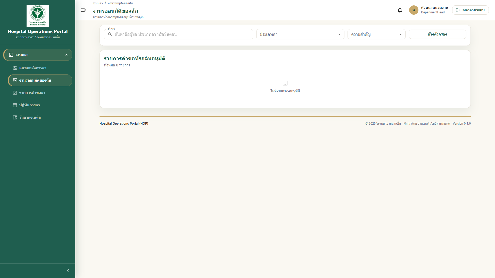

# 04 - คู่มือสำหรับหัวหน้างาน / ผู้อนุมัติ

## สารบัญ

1. [ภาพรวมการอนุมัติ](#ภาพรวมการอนุมัติ)
2. [วิธีดูรายการรออนุมัติ](#วิธีดูรายการรออนุมัติ)
3. [วิธีตรวจสอบรายละเอียดคำขอลา](#วิธีตรวจสอบรายละเอียดคำขอลา)
4. [Checklist สำหรับผู้อนุมัติ](#checklist-สำหรับผู้อนุมัติ)
5. [วิธีอนุมัติ](#วิธีอนุมัติ)
6. [วิธีไม่อนุมัติ](#วิธีไม่อนุมัติ)
7. [วิธีตีกลับรอแก้ไข](#วิธีตีกลับรอแก้ไข)
8. [วิธีใส่เหตุผล](#วิธีใส่เหตุผล)
9. [ข้อควรระวังเรื่องการอนุมัติแทนตนเอง](#ข้อควรระวังเรื่องการอนุมัติแทนตนเอง)
10. [ตัวอย่าง Workflow การอนุมัติ](#ตัวอย่าง-workflow-การอนุมัติ)
11. [Dashboard สำหรับหัวหน้าหน่วยงาน](#dashboard-สำหรับหัวหน้าหน่วยงาน)

## ภาพรวมการอนุมัติ

ระบบ HOP จะแสดงคำขอลาที่รอให้ท่านอนุมัติเฉพาะรายการที่ถึงคิวของท่านเท่านั้น ผู้อนุมัติไม่จำเป็นต้องค้นหาจากคำขอทั้งหมด

ตัวอย่าง:

เมื่อเจ้าหน้าที่ส่งคำขอลา ระบบจะแจ้งเตือนหัวหน้าหน่วยงานก่อน เมื่อหัวหน้าหน่วยงานอนุมัติแล้ว ระบบจึงส่งต่อไปยังผู้อนุมัติขั้นถัดไป เช่น ผู้อำนวยการ

> **Note:** รายการรออนุมัติของท่านอาจแสดงทั้งใน Dashboard, Notification Bell และเมนู `งานรออนุมัติของฉัน`

สำหรับหัวหน้าหน่วยงาน Dashboard จะแยก `คำขอลาของฉันที่รออนุมัติ` ออกจาก `คำขอลาของหน่วยงาน` เพื่อให้เห็นชัดว่าอะไรเป็นคำขอส่วนตัว และอะไรเป็นรายการของทีม

## วิธีดูรายการรออนุมัติ

1. Login เข้าระบบ HOP
2. ดู Card `งานรออนุมัติของฉัน` บน Dashboard หรือเปิดเมนู `งานรออนุมัติของฉัน`
3. คลิก `ดูทั้งหมด` หรือเข้าเมนู `งานรออนุมัติของฉัน`
4. ระบบจะแสดงรายการคำขอที่รอท่านดำเนินการ
5. คลิกรายการที่ต้องการตรวจสอบ

> **Tip:** หากไม่เห็นรายการที่ควรอนุมัติ ให้ตรวจสอบว่าเป็นคิวของท่านแล้วหรือยัง

## วิธีตรวจสอบรายละเอียดคำขอลา

1. คลิกรายการคำขอที่ต้องการตรวจสอบ
2. ตรวจสอบข้อมูลผู้ขอลา เช่น ชื่อ หน่วยงาน ตำแหน่ง
3. ตรวจสอบประเภทลา วันที่ลา จำนวนวัน และเหตุผล
4. ตรวจสอบไฟล์แนบ หากมี โดยกด `ดูตัวอย่าง` เป็นหลัก
5. ตรวจสอบวันลาคงเหลือและเงื่อนไขที่ระบบแจ้ง
6. ตรวจสอบ timeline การอนุมัติ
7. พิจารณาอนุมัติหรือไม่อนุมัติ

[ใส่รูปภาพ: หน้ารายละเอียดคำขอลาสำหรับผู้อนุมัติ]

## Checklist สำหรับผู้อนุมัติ

- [ ] ตรวจสอบชื่อผู้ขอลาและหน่วยงานถูกต้อง
- [ ] ตรวจสอบประเภทลาเหมาะสม
- [ ] ตรวจสอบวันที่และจำนวนวันลา
- [ ] ตรวจสอบเหตุผลการลา
- [ ] ตรวจสอบไฟล์แนบ หากจำเป็น
- [ ] หากเอกสารยังไม่ครบ ให้ใช้ `ตีกลับรอแก้ไข` แทนการไม่อนุมัติ
- [ ] ตรวจสอบผลกระทบต่อการปฏิบัติงานของหน่วยงาน
- [ ] อ่านหมายเหตุหรือ warning จากระบบ
- [ ] ใส่เหตุผลเมื่อไม่อนุมัติ

## วิธีอนุมัติ

1. เปิดรายละเอียดคำขอลา
2. ตรวจสอบข้อมูลให้ครบถ้วน
3. กดปุ่ม `อนุมัติ`
4. กรอกหมายเหตุเพิ่มเติม หากต้องการ
5. ยืนยันการอนุมัติ
6. ระบบจะบันทึกผลและส่งคำขอไปยังขั้นถัดไป หรือเปลี่ยนเป็น `อนุมัติแล้ว` หากเป็นขั้นสุดท้าย

> **Note:** เมื่ออนุมัติแล้ว ระบบจะบันทึกชื่อผู้อนุมัติ วันที่ และเวลาไว้ในประวัติ

## วิธีไม่อนุมัติ

1. เปิดรายละเอียดคำขอลา
2. ตรวจสอบข้อมูลให้ครบถ้วน
3. กดปุ่ม `ไม่อนุมัติ`
4. กรอกเหตุผลการไม่อนุมัติ
5. กดยืนยัน
6. ระบบจะเปลี่ยนสถานะคำขอเป็น `ไม่อนุมัติ`
7. ผู้ขอจะเห็นผลและเหตุผลตามที่ระบบแสดง

> **Warning:** การไม่อนุมัติควรระบุเหตุผลให้ชัดเจน เพื่อให้ผู้ขอเข้าใจและลดการสอบถามซ้ำ

## วิธีตีกลับรอแก้ไข

ใช้เมื่อต้องการให้ผู้ขอแก้ไขข้อมูลหรือแนบเอกสารเพิ่มเติม โดยยังไม่ปฏิเสธคำขอถาวร

1. เปิดรายละเอียดคำขอลา
2. ตรวจสอบข้อมูลคำขอและไฟล์แนบด้วยปุ่ม `ดูตัวอย่าง`
3. กดปุ่ม `ตีกลับรอแก้ไข`
4. ระบุเหตุผลให้ชัดเจน เช่น `กรุณาแนบใบรับรองแพทย์`
5. กดยืนยัน
6. ระบบจะแจ้งผู้ขอให้แก้ไขและส่งคำขอใหม่

> **Note:** หลังตีกลับแล้ว คำขอจะออกจากรายการ `งานรออนุมัติของฉัน` จนกว่าผู้ขอจะกด `ส่งคำขอใหม่`

## วิธีใส่เหตุผล

เหตุผลควรสั้น กระชับ และสุภาพ เช่น:

- เนื่องจากช่วงเวลาดังกล่าวมีภารกิจสำคัญของหน่วยงาน
- ขอให้ปรับวันลาใหม่เพื่อไม่ให้กระทบตารางเวร
- เอกสารประกอบยังไม่ครบถ้วน

ไม่ควรใช้ข้อความที่ไม่ชัดเจน เช่น:

- ไม่ได้
- ยังไม่ให้ลา
- ไม่เหมาะสม

## ข้อควรระวังเรื่องการอนุมัติแทนตนเอง

ระบบออกแบบให้ป้องกันการอนุมัติคำขอของตนเองโดยไม่เหมาะสม หากผู้ขอเป็นผู้อนุมัติในสายปกติ ระบบควรใช้ผู้อนุมัติสำรองหรือกฎที่โรงพยาบาลกำหนด

> **Warning:** ห้ามใช้บัญชีผู้อื่นเพื่ออนุมัติคำขอแทน เพราะระบบบันทึก Audit Log ตามบัญชีที่ Login

## ตัวอย่าง Workflow การอนุมัติ

ตัวอย่างกรณีเจ้าหน้าที่ขอลาพักผ่อน:

1. เจ้าหน้าที่สร้างคำขอลา
2. เจ้าหน้าที่กด `ส่งคำขอ`
3. ระบบแจ้งเตือนหัวหน้าหน่วยงาน
4. หัวหน้าหน่วยงานตรวจสอบและกด `อนุมัติ`
5. ระบบส่งต่อไปยังผู้อำนวยการ
6. ผู้อำนวยการตรวจสอบและกด `อนุมัติ`
7. ระบบเปลี่ยนสถานะเป็น `อนุมัติแล้ว`
8. ระบบแจ้งผลให้เจ้าหน้าที่ทราบ
9. ระบบบันทึกประวัติการอนุมัติทั้งหมด

ตัวอย่างกรณีเอกสารไม่ครบ:

1. เจ้าหน้าที่ส่งคำขอพร้อมเอกสารไม่ครบ
2. หัวหน้างานกด `ตีกลับรอแก้ไข`
3. เจ้าหน้าที่แก้ไขข้อมูลหรือแนบไฟล์เพิ่ม
4. เจ้าหน้าที่กด `ส่งคำขอใหม่`
5. คำขอกลับมาที่ขั้นอนุมัติเดิม

[ใส่รูปภาพ: Workflow การอนุมัติคำขอลา]

## Dashboard สำหรับหัวหน้าหน่วยงาน

หัวหน้าหน่วยงานมีข้อมูลบน Dashboard 3 ส่วนที่ควรแยกความหมายให้ชัดเจน:

| ส่วนบน Dashboard | ใช้ทำอะไร |
|---|---|
| `คำขอลาของฉันที่รออนุมัติ` | ติดตามคำขอลาของหัวหน้าเองที่ยังรออนุมัติ |
| `คำขอลาของหน่วยงาน` | ดูรายการคำขอของเจ้าหน้าที่ในหน่วยงานเดียวกัน โดยไม่รวมคำขอของหัวหน้าเอง |
| `งานรออนุมัติของฉัน` | ดูรายการที่ถึงคิวหัวหน้าอนุมัติจริง |

ขั้นตอนแนะนำ:

1. เริ่มจากดู `คำขอลาของฉันที่รออนุมัติ` เพื่อติดตามคำขอส่วนตัว
2. ดู `คำขอลาของหน่วยงาน` เพื่อประเมินภาพรวมของทีม
3. เปิด `งานรออนุมัติของฉัน` เพื่อดำเนินการอนุมัติ/ไม่อนุมัติ/ตีกลับ

> **Warning:** `คำขอลาของหน่วยงาน` เป็นมุมมองติดตามรายการ ไม่ใช่คิวอนุมัติทั้งหมด การอนุมัติต้องทำจากรายการที่ถึงคิวของท่านเท่านั้น

---

เอกสารนี้เป็นส่วนหนึ่งของโครงการ Hospital Operations Portal (HOP) โรงพยาบาลนาหมื่น
