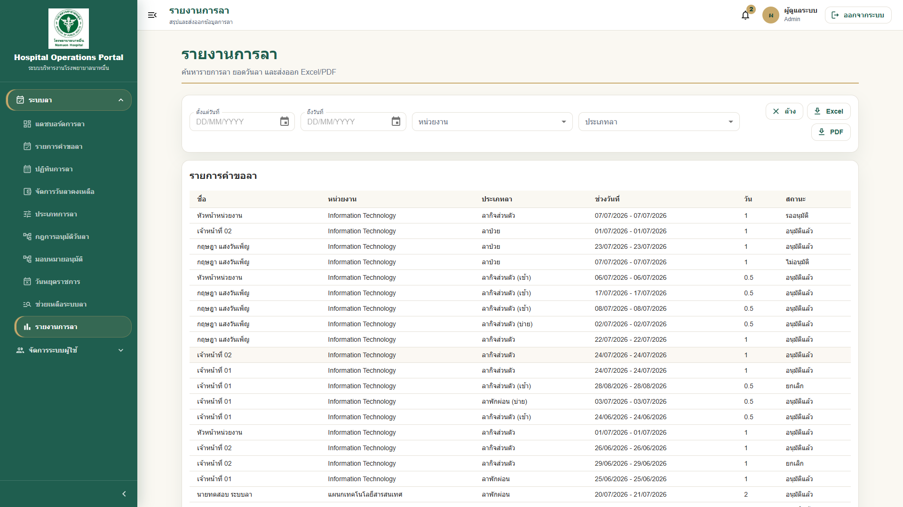
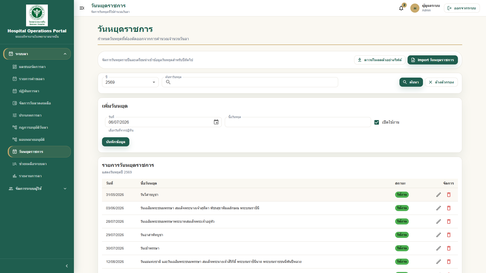

# 05 - คู่มือสำหรับเจ้าหน้าที่ HR

## สารบัญ

1. [ภาพรวมบทบาท HR](#ภาพรวมบทบาท-hr)
2. [การดูคำขอลาทั้งหมด](#การดูคำขอลาทั้งหมด)
3. [การตรวจสอบประวัติการลา](#การตรวจสอบประวัติการลา)
4. [การจัดการวันหยุด](#การจัดการวันหยุด)
5. [การตรวจสอบยอดวันลา](#การตรวจสอบยอดวันลา)
6. [การ Export รายงาน](#การ-export-รายงาน)
7. [การตรวจสอบเอกสารแนบ](#การตรวจสอบเอกสารแนบ)
8. [การช่วยเหลือผู้ใช้งาน](#การช่วยเหลือผู้ใช้งาน)
9. [Checklist สำหรับ HR](#checklist-สำหรับ-hr)

## ภาพรวมบทบาท HR

เจ้าหน้าที่ HR มีหน้าที่สนับสนุนการใช้งานระบบลา ตรวจสอบข้อมูลคำขอ วันหยุด ยอดวันลา และช่วยเหลือผู้ใช้งานเมื่อพบปัญหา ทั้งนี้สิทธิ์ที่เห็นจริงอาจขึ้นกับ Role และ Permission ที่ผู้ดูแลระบบกำหนด

> **Note:** ใน Phase 1 ระบบใช้ Role `LeaveAdmin` เป็นบทบาทสำหรับเจ้าหน้าที่ HR ด้านระบบลา และอาจใช้ `Admin` สำหรับผู้ดูแลระบบที่ช่วยงาน HR/Support เพิ่มเติม หากไม่เห็นเมนูที่ต้องใช้ ให้ตรวจสอบว่าบัญชีได้รับ Role `LeaveAdmin` หรือ Permission กลุ่ม `LeaveAdmin.*` แล้ว

## การดูคำขอลาทั้งหมด

1. Login เข้าระบบ HOP
2. ไปที่เมนู `ระบบลา`
3. เลือก `รายการคำขอลา` หรือเมนูรายงานที่เกี่ยวข้อง
4. ใช้ตัวกรอง เช่น ชื่อผู้ขอ หน่วยงาน ประเภทลา หรือสถานะ
5. คลิกคำขอเพื่อดูรายละเอียด
6. ตรวจสอบ timeline และประวัติการดำเนินการ

## การตรวจสอบประวัติการลา

1. ค้นหาชื่อเจ้าหน้าที่หรือหน่วยงาน
2. เลือกช่วงวันที่ที่ต้องการตรวจสอบ
3. ตรวจสอบรายการคำขอที่อนุมัติ ไม่อนุมัติ หรือยกเลิก
4. เปิดรายละเอียดเพื่อดูเหตุผลและผู้อนุมัติ
5. หากต้องใช้เอกสาร ให้ดาวน์โหลด PDF หรือรายงานตามสิทธิ์

ตัวอย่าง:

HR ต้องการตรวจสอบประวัติการลาของเจ้าหน้าที่ในแผนกเทคโนโลยีสารสนเทศ ให้กรองหน่วยงานและช่วงปีงบประมาณที่ต้องการ

## การจัดการวันหยุด

1. ไปที่เมนู `วันหยุดราชการ`
2. เลือกปีที่ต้องการ
3. ตรวจสอบรายการวันหยุด
4. เพิ่มวันหยุดใหม่ หากมีสิทธิ์
5. แก้ไขหรือลบรายการที่ไม่ถูกต้อง หากระบบอนุญาต
6. หากมีไฟล์ import ให้ตรวจสอบ preview ก่อนยืนยัน

> **Warning:** การตั้งค่าวันหยุดมีผลต่อการคำนวณจำนวนวันลา ควรตรวจสอบให้ถูกต้องก่อนเปิดใช้งานจริง

## การตรวจสอบยอดวันลา

1. ไปที่เมนู `วันลาคงเหลือ`
2. เลือกปีงบประมาณ
3. กรองตามผู้ใช้งาน หน่วยงาน หรือประเภทลา
4. ตรวจสอบสิทธิ์ประจำปี ยอดยกมา ใช้ไป รออนุมัติ และคงเหลือ
5. หากยอดไม่ถูกต้อง ให้ตรวจสอบประวัติคำขอและการปรับยอด
6. หากต้องปรับยอด ให้ระบุเหตุผลตามระเบียบ

ตารางความหมายยอดวันลา:

| รายการ | ความหมาย |
|---|---|
| สิทธิ์ประจำปี | จำนวนวันที่ได้รับในปีงบประมาณ |
| ยกมาจากปีก่อน | ยอดที่ยกมาจากปีเดิม |
| ใช้ไปแล้ว | วันลาที่อนุมัติและถูกหัก |
| รออนุมัติ | คำขอที่ส่งแล้วแต่ยังไม่อนุมัติครบ |
| คงเหลือใช้ได้ | ยอดที่ผู้ใช้ยังสามารถขอได้ |

## การ Export รายงาน

1. ไปที่หน้ารายงานหรือหน้ารายการที่ต้องการ
2. ตั้งค่าตัวกรอง เช่น ปีงบประมาณ หน่วยงาน ประเภทลา
3. กด `Export` หรือ `ดาวน์โหลด`
4. เลือกรูปแบบไฟล์ เช่น Excel หรือ PDF หากระบบรองรับ
5. ตรวจสอบไฟล์หลังดาวน์โหลด

> **Tip:** ก่อนส่งรายงานให้ผู้บริหาร ควรตรวจสอบตัวกรองและช่วงวันที่ทุกครั้ง

## การตรวจสอบเอกสารแนบ

1. เปิดรายละเอียดคำขอลา
2. ไปที่ส่วน `ไฟล์แนบ`
3. ตรวจสอบชื่อไฟล์ ประเภทไฟล์ และวันที่อัปโหลด
4. ดาวน์โหลดไฟล์เพื่อตรวจสอบ หากจำเป็น
5. หากเอกสารไม่ครบ ให้แจ้งผู้ขอหรือผู้เกี่ยวข้อง

## การช่วยเหลือผู้ใช้งาน

กรณีผู้ใช้ติดต่อ HR:

1. สอบถามชื่อ-นามสกุลและ username
2. สอบถามเลขที่คำขอ หากมี
3. ตรวจสอบสถานะคำขอในระบบ
4. อธิบายสถานะและขั้นตอนถัดไปให้ผู้ใช้ทราบ
5. หากเป็นปัญหาสิทธิ์หรือระบบ ให้ส่งต่อ IT

ข้อมูลที่ควรเก็บเมื่อส่งต่อ IT:

| ข้อมูล | ตัวอย่าง |
|---|---|
| Username | staff01 |
| เลขที่คำขอ | LV-256907-001 |
| ปัญหา | ส่งคำขอไม่ได้ |
| วันที่เกิดปัญหา | 02/07/2569 |
| ภาพหน้าจอ | แนบไฟล์ภาพ |

## Checklist สำหรับ HR

- [ ] ตรวจสอบวันหยุดราชการก่อนเริ่มปีงบประมาณ
- [ ] ตรวจสอบยอดวันลาของบุคลากร
- [ ] ตรวจสอบประเภทลาและเงื่อนไขที่ใช้งาน
- [ ] ตรวจสอบคำขอที่ค้างนานผิดปกติ
- [ ] ตรวจสอบเอกสารแนบที่จำเป็น
- [ ] ส่งต่อปัญหาระบบให้ IT พร้อมข้อมูลครบถ้วน

---

เอกสารนี้เป็นส่วนหนึ่งของโครงการ Hospital Operations Portal (HOP) โรงพยาบาลนาหมื่น
