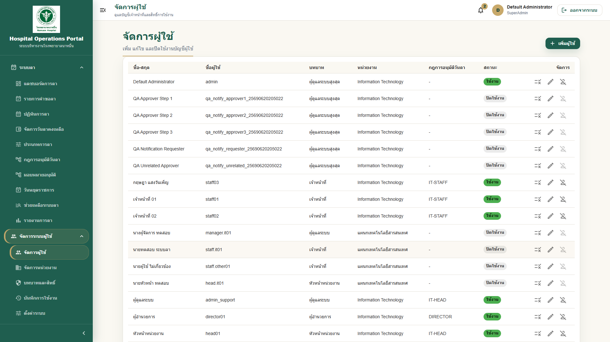
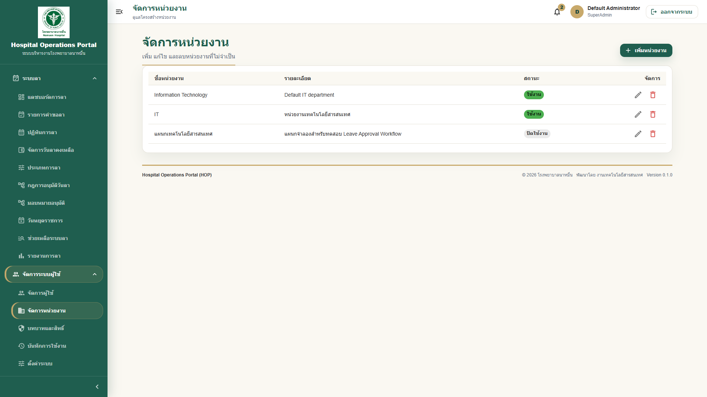
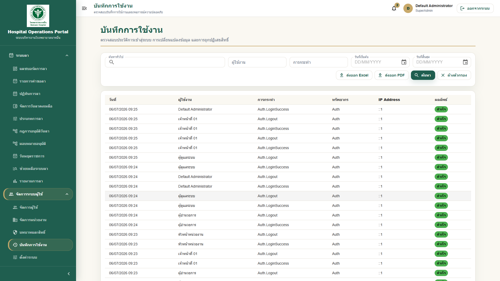

# 06 - คู่มือสำหรับผู้ดูแลระบบ

## สารบัญ

1. [ภาพรวมบทบาทผู้ดูแลระบบ](#ภาพรวมบทบาทผู้ดูแลระบบ)
2. [การจัดการผู้ใช้งาน](#การจัดการผู้ใช้งาน)
3. [การเพิ่มผู้ใช้](#การเพิ่มผู้ใช้)
4. [การแก้ไขผู้ใช้](#การแก้ไขผู้ใช้)
5. [การปิดใช้งานผู้ใช้](#การปิดใช้งานผู้ใช้)
6. [การจัดการหน่วยงาน](#การจัดการหน่วยงาน)
7. [การจัดการ Role](#การจัดการ-role)
8. [การจัดการ Permission](#การจัดการ-permission)
9. [การตรวจสอบ Audit Log](#การตรวจสอบ-audit-log)
10. [ข้อควรระวังด้านสิทธิ์](#ข้อควรระวังด้านสิทธิ์)
11. [การตรวจสอบ Backup Center](#การตรวจสอบ-backup-center)
12. [Checklist สำหรับ Admin](#checklist-สำหรับ-admin)

## ภาพรวมบทบาทผู้ดูแลระบบ

ผู้ดูแลระบบมีหน้าที่ดูแลข้อมูลผู้ใช้งาน หน่วยงาน บทบาท สิทธิ์ และตรวจสอบ Audit Log เพื่อให้ระบบ HOP ทำงานได้ถูกต้องและปลอดภัย

> **Warning:** ผู้ดูแลระบบควรใช้สิทธิ์เท่าที่จำเป็น และหลีกเลี่ยงการแก้ไขข้อมูลแทนผู้ใช้งานโดยไม่มีเหตุผล

## Admin Dashboard

Admin Dashboard เป็นศูนย์ควบคุมผู้ดูแลระบบ ไม่ใช่หน้าจัดการข้อมูลแบบ CRUD โดยตรง

ข้อมูลที่ควรเห็น:

| ส่วน | ใช้ทำอะไร |
|---|---|
| คำขอลาของฉัน | ตรวจคำขอลาที่เกี่ยวข้องกับบัญชีผู้ดูแล หากมี |
| คำขอยกเลิกใบลา | monitor คำขอยกเลิกใบลาตามสิทธิ์ support/admin |
| ผู้ใช้งาน / หน่วยงาน / Role & Permission | ดูภาพรวมและกดไปหน้าจัดการจริง |
| ระบบลา | ตรวจคำขอวันนี้และข้อมูล balance ที่ควรตรวจสอบ |
| สิ่งที่ควรตรวจสอบ | warning/to-do ก่อน pilot หรือ production |
| Health Summary | ดู API, Database, Storage, LINE, Backup, Disk |

> **Note:** Admin/SuperAdmin ไม่เห็น `งานรออนุมัติของฉัน` แบบผู้อนุมัติปกติ และโดย default ไม่ควรมีสิทธิ์สร้างคำขอลาแทนผู้ใช้งาน

## การจัดการผู้ใช้งาน

1. Login ด้วยบัญชีผู้ดูแลระบบ
2. ไปที่เมนู `จัดการผู้ใช้งาน`
3. ค้นหาผู้ใช้จากชื่อ username หรือหน่วยงาน
4. ตรวจสอบสถานะบัญชีและบทบาท
5. เลือกเพิ่ม แก้ไข หรือปิดใช้งานตามความจำเป็น

## การเพิ่มผู้ใช้

1. ไปที่เมนู `จัดการผู้ใช้งาน`
2. กด `เพิ่มผู้ใช้งาน`
3. กรอกข้อมูลพื้นฐาน เช่น ชื่อ-นามสกุล username และรหัสผ่านเริ่มต้น
4. เลือกหน่วยงาน
5. เลือก Role ให้เหมาะสม
6. กรอกข้อมูลเพิ่มเติม เช่น ตำแหน่ง เบอร์โทรศัพท์ อีเมล หากมี
7. กด `บันทึก`
8. แจ้ง username และรหัสผ่านเริ่มต้นให้ผู้ใช้ตามช่องทางที่ปลอดภัย

> **Tip:** ควรให้ผู้ใช้เปลี่ยนรหัสผ่านหลัง Login ครั้งแรก

## การแก้ไขผู้ใช้

1. ค้นหาผู้ใช้ที่ต้องการ
2. กดปุ่ม `แก้ไข`
3. แก้ไขข้อมูลที่จำเป็น
4. ตรวจสอบ Role และหน่วยงานก่อนบันทึก
5. กด `บันทึก`

> **Warning:** การเปลี่ยน Role หรือ Permission อาจทำให้ผู้ใช้เห็นเมนูเพิ่มขึ้นหรือลดลง ควรตรวจสอบให้ตรงกับหน้าที่จริง

## การปิดใช้งานผู้ใช้

1. ค้นหาผู้ใช้ที่ต้องการปิดใช้งาน
2. กด `ปิดใช้งาน` หรือ `ลบ` ตามชื่อปุ่มในระบบ
3. ยืนยันการดำเนินการ
4. ระบบจะเปลี่ยนสถานะผู้ใช้เป็นไม่ใช้งาน

กรณีที่ควรปิดใช้งาน:

- บุคลากรย้ายหน่วยงานและไม่ใช้บัญชีเดิม
- บุคลากรลาออก
- บัญชีทดสอบไม่จำเป็นแล้ว
- บัญชีมีความเสี่ยงด้านความปลอดภัย

## การจัดการหน่วยงาน

1. ไปที่เมนู `จัดการหน่วยงาน`
2. ตรวจสอบรายชื่อหน่วยงาน
3. เพิ่มหน่วยงานใหม่หากจำเป็น
4. แก้ไขชื่อหรือรายละเอียดหน่วยงาน
5. ลบหรือปิดใช้งานหน่วยงานที่ไม่จำเป็น หากระบบอนุญาต

> **Note:** ก่อนลบหน่วยงาน ควรตรวจสอบว่ามีผู้ใช้งานหรือข้อมูลคำขอผูกอยู่หรือไม่

## การจัดการ Role

Role คือบทบาทของผู้ใช้งาน เช่น Staff, DepartmentHead, Director, Admin, SuperAdmin

1. ไปที่เมนู `บทบาทและสิทธิ์`
2. เลือก Role ที่ต้องการดูหรือแก้ไข
3. ตรวจสอบ Permission ที่ผูกกับ Role
4. แก้ไขสิทธิ์ตามหน้าที่จริง
5. กด `บันทึก`

## การจัดการ Permission

Permission คือสิทธิ์ย่อยที่กำหนดว่าผู้ใช้ทำอะไรได้บ้าง เช่น ดูคำขอของตนเอง อนุมัติคำขอ หรือจัดการวันหยุด

ตัวอย่าง:

| Permission | ความหมาย |
|---|---|
| LeaveRequest.ViewOwn | ดูคำขอลาของตนเอง |
| LeaveRequest.Create | สร้างคำขอลา |
| LeaveApproval.ApproveCurrentStep | อนุมัติคำขอที่ถึงคิวตนเอง |
| LeaveAdmin.ManageHolidays | จัดการวันหยุดราชการ |
| UserManagement.View | ดูข้อมูลผู้ใช้งาน |

> **Warning:** ไม่ควรให้สิทธิ์ ViewAll หรือ SuperAdmin กับผู้ใช้ทั่วไป เพราะอาจเห็นข้อมูลเกินความจำเป็น

## การตรวจสอบ Audit Log

Audit Log ใช้ตรวจสอบกิจกรรมในระบบ เช่น Login, แก้ไขผู้ใช้, อนุมัติคำขอ, ไม่อนุมัติคำขอ และการเปลี่ยนสิทธิ์

1. ไปที่เมนู `บันทึกการใช้งาน`
2. เลือกตัวกรอง เช่น ผู้ใช้งาน การกระทำ หรือวันที่
3. กดค้นหา
4. ตรวจสอบรายละเอียดเหตุการณ์
5. Export รายงาน หากระบบรองรับ

## ข้อควรระวังด้านสิทธิ์

1. ให้สิทธิ์ตามหน้าที่จริงเท่านั้น
2. ตรวจสอบ Role หลังเพิ่มผู้ใช้ใหม่ทุกครั้ง
3. ไม่ใช้บัญชี SuperAdmin ในงานประจำวันหากไม่จำเป็น
4. บันทึกเหตุผลเมื่อแก้ไขสิทธิ์สำคัญ
5. ตรวจสอบ Audit Log หากพบเหตุการณ์ผิดปกติ

## การตรวจสอบ Backup Center

Backup Center ใช้สำหรับตรวจสอบว่าระบบมีการสำรองข้อมูลล่าสุดครบทั้งฐานข้อมูลและไฟล์แนบของระบบหรือไม่ รวมถึงตรวจประวัติ restore และ retention policy

1. Login ด้วยบัญชี Admin หรือ SuperAdmin
2. ไปที่เมนู `จัดการระบบ`
3. เลือก `Backup Center`
4. เปิด tab `Overview` เพื่อตรวจเวลาสำรองข้อมูลล่าสุด
5. เปิด tab `Backup History` เพื่อตรวจชื่อไฟล์ฐานข้อมูลและ storage ล่าสุด
6. กด `Verify` เมื่อต้องการตรวจความสมบูรณ์ของไฟล์ backup
7. เปิด tab `Restore` เฉพาะเมื่อได้รับมอบหมายให้ทำ restore preview
8. เปิด tab `Restore History` เพื่อตรวจประวัติ restore test/restore request
9. เปิด tab `Retention` เพื่อ preview รายการที่จะลบก่อน apply policy
10. ตรวจว่ามีหลักฐานทดสอบ restore รายเดือน

ค่ามาตรฐานที่ควรรู้:

| รายการ | ค่ามาตรฐาน |
|---|---|
| Database backup path | `/opt/hop/backups/postgres` |
| Database file name | `hopdb_YYYYMMDD_HHMMSS.backup` |
| Storage backup path | `/opt/hop/backups/storage` |
| Storage file name | `hop_uploads_YYYYMMDD_HHMMSS.tar.gz` |
| Backup env | `/etc/hop/backup.env` |

สิทธิ์ที่เกี่ยวข้อง:

| Permission | ความหมาย |
|---|---|
| `System.Backup.View` | ดู Backup Center |

## การตรวจสอบ Diagnostics Center

Diagnostics Center ใช้เมื่อต้องการตรวจปัญหาเชิงลึกหรือส่งข้อมูลให้ทีม IT โดยไม่เปิดเผยข้อมูลลับ

1. เปิดเมนู `จัดการระบบ`
2. เลือก `Diagnostics Center`
3. ตรวจสถานะรวมของระบบในแท็บ `ภาพรวม`
4. รัน test เฉพาะจุดในแท็บ `Tests`
5. ค้นหา Reference ID ในแท็บ `Logs`
6. สร้าง Support Bundle ในแท็บ `Support Bundle` พร้อมระบุเหตุผล

> **Warning:** Support Bundle ต้องไม่ใช้แทนการส่งไฟล์ config จริง ห้ามส่ง token, secret, password หรือ connection string ผ่านช่องทางทั่วไป

| Permission | ใช้สำหรับ |
|---|---|
| `System.Diagnostics.View` | เปิด Diagnostics Center และดูข้อมูล |
| `System.Diagnostics.Run` | รัน Diagnostics Test |
| `System.Diagnostics.Export` | สร้างและดาวน์โหลด Support Bundle |
| `System.Backup.Run` | Verify backup |
| `System.Backup.Restore` | Restore preview และบันทึก restore request |
| `System.Backup.ManageRetention` | Preview/apply retention policy |

> **Warning:** Restore production ต้องทำใน maintenance window พร้อมผู้อนุมัติ และต้องมี pre-restore backup ก่อนเสมอ

> **Tip:** หลัง deploy หรือ migration ให้บันทึกชื่อไฟล์ backup ล่าสุด เช่น `hopdb_20260709_142201.backup` ไว้ใน deploy note

## Checklist สำหรับ Admin

- [ ] เพิ่มผู้ใช้พร้อมหน่วยงานและ Role ที่ถูกต้อง
- [ ] ตรวจสอบว่าผู้ใช้ Login ได้
- [ ] ตรวจสอบเมนูที่ผู้ใช้เห็นหลังตั้งสิทธิ์
- [ ] ปิดใช้งานบัญชีที่ไม่ใช้แล้ว
- [ ] ตรวจสอบ Audit Log เป็นระยะ
- [ ] สำรองข้อมูลตามรอบที่กำหนด
- [ ] ตรวจ Backup Center หลัง deploy และหลัง backup schedule ทำงาน
- [ ] Verify backup สำคัญหลัง backup job
- [ ] ตรวจ Restore History หลังซ้อม restore
- [ ] Preview Retention ก่อน apply ทุกครั้ง
- [ ] มี restore-test evidence อย่างน้อยเดือนละครั้ง
- [ ] ไม่เปิดสิทธิ์เกินจำเป็น

---

เอกสารนี้เป็นส่วนหนึ่งของโครงการ Hospital Operations Portal (HOP) โรงพยาบาลนาหมื่น
