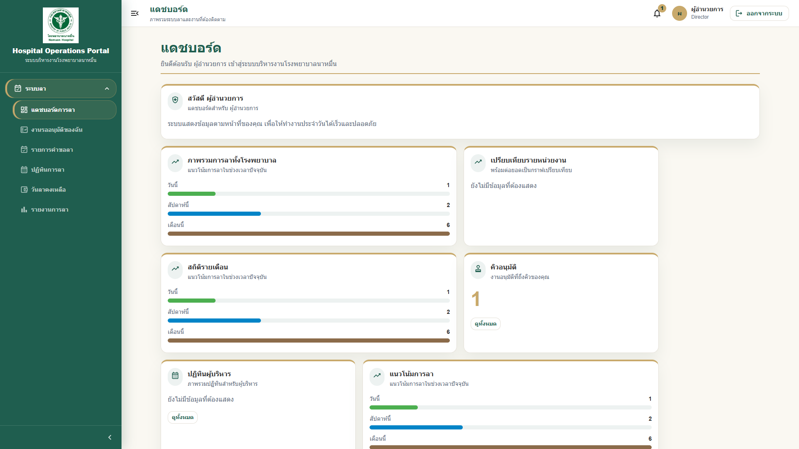

# 07 - คู่มือสำหรับผู้บริหาร

## สารบัญ

1. [ภาพรวมสำหรับผู้บริหาร](#ภาพรวมสำหรับผู้บริหาร)
2. [การดูภาพรวม Dashboard](#การดูภาพรวม-dashboard)
3. [การดูรายงานผู้ลางาน](#การดูรายงานผู้ลางาน)
4. [การดูงานรออนุมัติ](#การดูงานรออนุมัติ)
5. [การดูข้อมูลสรุปเพื่อประกอบการตัดสินใจ](#การดูข้อมูลสรุปเพื่อประกอบการตัดสินใจ)
6. [ข้อแนะนำการใช้งาน](#ข้อแนะนำการใช้งาน)

## ภาพรวมสำหรับผู้บริหาร

ผู้บริหารสามารถใช้ HOP เพื่อติดตามภาพรวมงานภายใน โดยเฉพาะข้อมูลระบบลา งานรออนุมัติ และข้อมูลสรุปที่เกี่ยวข้องกับการบริหารกำลังคน

> **Note:** Dashboard ของผู้บริหารอาจแสดงข้อมูลระดับสรุปมากกว่ารายละเอียดรายบุคคล ขึ้นอยู่กับสิทธิ์ที่โรงพยาบาลกำหนด

## การดูภาพรวม Dashboard

1. Login เข้าระบบ HOP
2. ระบบจะแสดงหน้า Dashboard
3. ดู Card สรุปข้อมูล เช่น งานรออนุมัติ ผู้ลาวันนี้ หรือคำขอที่รอดำเนินการ
4. คลิก Card เพื่อดูรายละเอียด หากระบบรองรับ
5. ใช้ข้อมูลประกอบการติดตามงานและตัดสินใจ

ลำดับ Card บน Dashboard ผู้บริหารล่าสุดจะเริ่มจากข้อมูลที่เกี่ยวข้องกับตนเองก่อน แล้วจึงตามด้วยข้อมูลเชิงบริหาร:

1. `คำขอลาของฉัน`
2. `คำขอยกเลิกใบลา`
3. `เปรียบเทียบรายหน่วยงาน`
4. `สถิติรายเดือน`
5. `คิวอนุมัติ`
6. `ปฏิทินผู้บริหาร`
7. `แนวโน้มการลา`
8. `ภาพรวมการลาทั้งโรงพยาบาล` ในส่วนล่างของหน้า

## การดูรายงานผู้ลางาน

1. ไปที่เมนู `รายงานการลา` หรือส่วนรายงานใน Dashboard
2. เลือกช่วงวันที่หรือปีงบประมาณ
3. เลือกหน่วยงาน หากต้องการดูเฉพาะหน่วยงาน
4. ตรวจสอบจำนวนผู้ลา ประเภทลา และแนวโน้ม
5. Export รายงาน หากต้องการใช้ประกอบการประชุม

ตัวอย่าง:

ผู้บริหารต้องการดูภาพรวมบุคลากรลาวันนี้ เพื่อประกอบการบริหารอัตรากำลังในหน่วยงานที่มีภาระงานสูง

### รายงานการลาและวิเคราะห์การลาแตกต่างกันอย่างไร

| หน้า | ใช้เมื่อ | ตัวอย่างการใช้งาน |
|---|---|---|
| `รายงานการลา` | ต้องการดูรายการเชิงปฏิบัติการและ export Excel/PDF | ตรวจรายการคำขอลา, รายงานคำขอยกเลิกใบลา, ส่งออกไฟล์ประกอบประชุม |
| `วิเคราะห์การลา` | ต้องการดูแนวโน้มและข้อมูลประกอบการตัดสินใจ | ดูกราฟรายเดือน รายปีงบประมาณ หน่วยงานที่มีการลาสูง และ heatmap |

> **Note:** Director สามารถเข้า `รายงานการลา` และ `วิเคราะห์การลา` ได้ตาม policy ผู้บริหาร หรือผ่าน permission `ReportManagement.View` / `LeaveAnalytics.View`

## การดูงานรออนุมัติ

หากผู้บริหารเป็นผู้อนุมัติใน workflow:

1. ดู Card `งานรออนุมัติของฉัน`
2. คลิกเข้าไปดูรายการ
3. ตรวจสอบคำขอแต่ละรายการ
4. อนุมัติหรือไม่อนุมัติตามข้อมูลประกอบ

> **Warning:** ผู้บริหารควรอนุมัติเฉพาะรายการที่ถึงคิวของตนเองตาม workflow และไม่ควรใช้บัญชีผู้อื่นในการดำเนินการ

## การดูข้อมูลสรุปเพื่อประกอบการตัดสินใจ

ข้อมูลที่ควรติดตาม:

| ข้อมูล | ประโยชน์ |
|---|---|
| จำนวนผู้ลาวันนี้ | ประเมินกำลังคนประจำวัน |
| คำขอรออนุมัติ | ลดงานค้างและความล่าช้า |
| คำขอยกเลิกใบลา | ตรวจการคืนวันลาและผลกระทบต่อกำลังคนหลังยกเลิกใบลา |
| ประเภทลาที่ใช้บ่อย | วิเคราะห์แนวโน้มการลา |
| หน่วยงานที่มีผู้ลามาก | วางแผนสนับสนุนอัตรากำลัง |
| Audit Log สำคัญ | ตรวจสอบเหตุการณ์ผิดปกติ |

## ข้อแนะนำการใช้งาน

1. ตรวจ Dashboard เป็นประจำในช่วงเริ่มงานหรือก่อนประชุม
2. ตรวจงานรออนุมัติอย่างสม่ำเสมอเพื่อลดความล่าช้า
3. ใช้รายงานประกอบการตัดสินใจ ไม่ใช้ข้อมูลจากการสอบถามอย่างเดียว
4. หากพบข้อมูลผิดปกติ ให้แจ้ง HR หรือ IT เพื่อตรวจสอบ
5. ไม่เปิดเผยข้อมูลส่วนบุคคลให้ผู้ที่ไม่มีสิทธิ์รับทราบ

---

เอกสารนี้เป็นส่วนหนึ่งของโครงการ Hospital Operations Portal (HOP) โรงพยาบาลนาหมื่น
