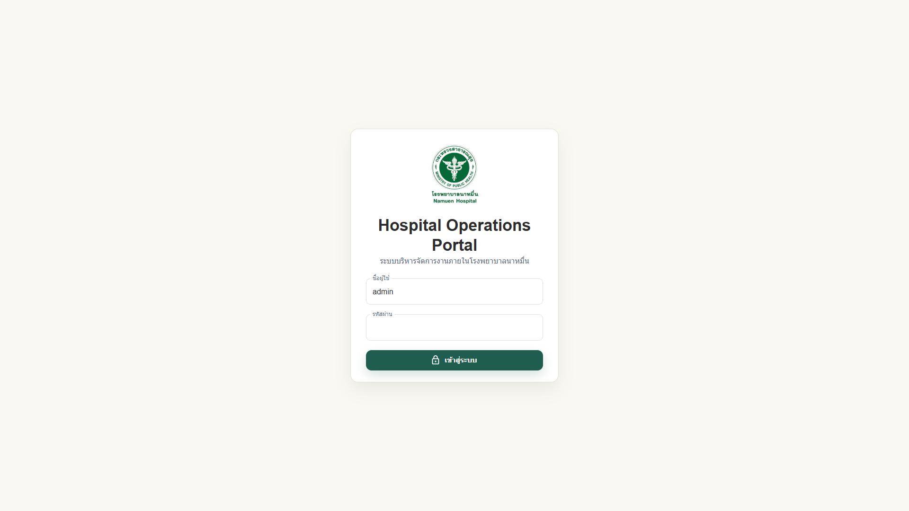

# 11 - คู่มือใช้งาน HOP แบบ 1 หน้า

## สารบัญ

1. [สำหรับเจ้าหน้าที่](#สำหรับเจ้าหน้าที่)
2. [ขั้นตอน Login](#ขั้นตอน-login)
3. [ขั้นตอนขอลา](#ขั้นตอนขอลา)
4. [ขั้นตอนอนุมัติ](#ขั้นตอนอนุมัติ)
5. [ขั้นตอนติดตามสถานะ](#ขั้นตอนติดตามสถานะ)
6. [ช่องทางติดต่อ IT](#ช่องทางติดต่อ-it)

## สำหรับเจ้าหน้าที่

Hospital Operations Portal (HOP) เป็นระบบสำหรับใช้งานภายในโรงพยาบาลนาหมื่น Phase 1 ประกอบด้วย Dashboard, User Management และ Leave Management

> **Tip:** หากใช้งานครั้งแรก ให้ Login แล้วตรวจสอบชื่อ หน่วยงาน และเมนูที่เห็นก่อนเริ่มใช้งาน

## ขั้นตอน Login

1. เปิด browser
2. เข้า URL ระบบ HOP ที่โรงพยาบาลกำหนด
3. กรอก Username
4. กรอก Password
5. กด `เข้าสู่ระบบ`
6. ตรวจสอบหน้า Dashboard

## ขั้นตอนขอลา

1. ไปที่เมนู `ระบบลา`
2. เลือก `รายการคำขอลา`
3. กด `เพิ่มคำขอลา`
4. เลือกประเภทลา
5. เลือกวันที่เริ่มและวันที่สิ้นสุด
6. เลือกเต็มวันหรือครึ่งวัน
7. กรอกเหตุผล
8. แนบไฟล์ หากจำเป็น
9. กด `บันทึก`
10. ตรวจสอบข้อมูล แล้วกด `ส่งคำขอ`

Checklist ก่อนส่ง:

- [ ] ประเภทลาถูกต้อง
- [ ] วันที่ถูกต้อง
- [ ] จำนวนวันถูกต้อง
- [ ] เหตุผลครบถ้วน
- [ ] แนบไฟล์แล้ว หากจำเป็น
- [ ] วันลาคงเหลือเพียงพอ

## ขั้นตอนอนุมัติ

สำหรับหัวหน้างานหรือผู้อนุมัติ:

1. ดู Card `งานรออนุมัติของฉัน`
2. กด `ดูทั้งหมด`
3. คลิกคำขอ
4. ตรวจสอบข้อมูลผู้ขอ วันที่ลา เหตุผล และไฟล์แนบ
5. กด `อนุมัติ` หรือ `ไม่อนุมัติ`
6. หากไม่อนุมัติ ให้ใส่เหตุผล
7. กดยืนยัน

## ขั้นตอนติดตามสถานะ

1. ไปที่ `รายการคำขอลา`
2. ดูสถานะในตาราง
3. คลิกคำขอเพื่อดูรายละเอียด
4. ดูส่วน `สถานะเอกสาร`
5. ดู `สายอนุมัติ` ว่ารอใครดำเนินการ

สถานะที่พบได้:

| สถานะ | ความหมาย |
|---|---|
| แบบร่าง | ยังไม่ส่ง |
| รออนุมัติ | ส่งแล้ว รอผู้อนุมัติ |
| อนุมัติแล้ว | อนุมัติครบแล้ว |
| ไม่อนุมัติ | ถูกปฏิเสธ |
| ยกเลิกแล้ว | คำขอถูกยกเลิก |

## ช่องทางติดต่อ IT

เมื่อพบปัญหา ให้แจ้งข้อมูลต่อไปนี้:

1. ชื่อ-นามสกุล
2. Username
3. หน่วยงาน
4. เมนูที่ใช้งาน
5. วันและเวลาที่เกิดปัญหา
6. ข้อความ error
7. ภาพหน้าจอ

> **Warning:** ห้ามส่งรหัสผ่านให้ผู้อื่น หากต้องการ reset password ให้แจ้งผู้ดูแลระบบตามขั้นตอน

---

เอกสารนี้เป็นส่วนหนึ่งของโครงการ Hospital Operations Portal (HOP) โรงพยาบาลนาหมื่น
