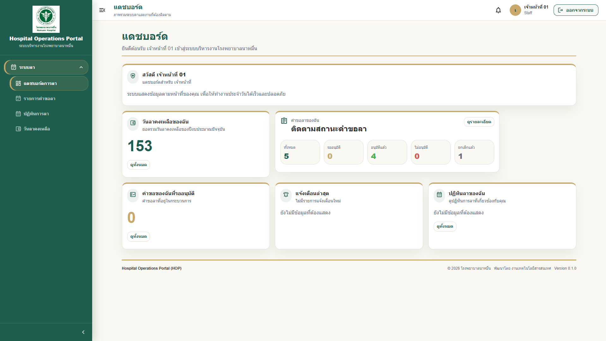

<!--
Generated by docs/manuals/scripts build process.
Do not edit this file directly. Edit source Markdown files in docs/manuals/phase1/ instead.
-->


<div class="page-break"></div>

# คู่มือการใช้งานระบบ Hospital Operations Portal (HOP) Phase 1

โรงพยาบาลนาหมื่น

## สารบัญ

1. [ภาพรวมคู่มือ](#ภาพรวมคู่มือ)
2. [วัตถุประสงค์](#วัตถุประสงค์)
3. [กลุ่มผู้ใช้งาน](#กลุ่มผู้ใช้งาน)
4. [รายการคู่มือย่อย](#รายการคู่มือย่อย)
5. [วิธีอ่านคู่มือ](#วิธีอ่านคู่มือ)
6. [สรุปเมนูและสิทธิ์การใช้งาน](#สรุปเมนูและสิทธิ์การใช้งาน)

## ภาพรวมคู่มือ

คู่มือนี้จัดทำขึ้นเพื่อแนะนำการใช้งานระบบ Hospital Operations Portal (HOP) Phase 1 สำหรับเจ้าหน้าที่โรงพยาบาลนาหมื่น โดยเน้นการใช้งานจริงในชีวิตประจำวัน อ่านง่าย เป็นขั้นตอน และเหมาะสำหรับผู้ใช้งานทั่วไปที่ไม่ใช่เจ้าหน้าที่ IT

Phase 1 ประกอบด้วยโมดูลหลัก 3 ส่วน:

1. Dashboard
2. User Management
3. Leave Management

> **Note:** คู่มือนี้อธิบายเฉพาะระบบใน Phase 1 เท่านั้น โมดูลอื่น เช่น Inventory, Repair Request และ Executive Report อาจจัดทำคู่มือเพิ่มเติมในระยะถัดไป

## วัตถุประสงค์

1. เพื่อให้เจ้าหน้าที่สามารถเข้าใช้งานระบบ HOP ได้อย่างถูกต้อง
2. เพื่อให้ผู้ใช้งานสามารถสร้าง ติดตาม และจัดการคำขอลาได้
3. เพื่อให้หัวหน้างานและผู้อนุมัติสามารถตรวจสอบและอนุมัติคำขอลาได้อย่างเป็นระบบ
4. เพื่อให้ HR และผู้ดูแลระบบสามารถสนับสนุนการใช้งาน Phase 1 ได้
5. เพื่อช่วยลดความสับสนในการใช้งานและลดการสอบถามซ้ำ

## กลุ่มผู้ใช้งาน

| กลุ่มผู้ใช้งาน | ตัวอย่างหน้าที่ | คู่มือที่ควรอ่าน |
|---|---|---|
| ผู้ใช้งานทั่วไป | Login, ดู Dashboard, ขอลา, ติดตามสถานะ | 01, 02, 03, 08, 11 |
| หัวหน้างาน / ผู้อนุมัติ | ตรวจคำขอ อนุมัติ ไม่อนุมัติ | 01, 02, 04, 08, 11 |
| เจ้าหน้าที่ HR | ตรวจสอบคำขอลา วันหยุด ยอดวันลา รายงาน | 01, 03, 05, 08, 09 |
| ผู้ดูแลระบบ | จัดการผู้ใช้ หน่วยงาน Role Permission Audit Log และ Backup Center | 01, 06, 09, 10 |
| ผู้บริหาร | ดูภาพรวม Dashboard รายงาน และงานรออนุมัติ | 02, 04, 07, 11 |

## รายการคู่มือย่อย

| ลำดับ | ไฟล์ | รายละเอียด |
|---:|---|---|
| 1 | [01-Getting-Started.md](01-Getting-Started.md) | เริ่มต้นใช้งาน Login, Logout, เปลี่ยนรหัสผ่าน, Session และความปลอดภัย |
| 2 | [02-Dashboard-User-Guide.md](02-Dashboard-User-Guide.md) | การดู Dashboard, KPI Card และสถานะงาน |
| 3 | [03-Leave-User-Guide.md](03-Leave-User-Guide.md) | คู่มือขอลา ติดตามสถานะ ยกเลิก และดาวน์โหลด PDF |
| 4 | [04-Approval-User-Guide.md](04-Approval-User-Guide.md) | คู่มือสำหรับหัวหน้างานและผู้อนุมัติ |
| 5 | [05-HR-User-Guide.md](05-HR-User-Guide.md) | คู่มือสำหรับ HR และงานสนับสนุนระบบลา |
| 6 | [06-Admin-User-Guide.md](06-Admin-User-Guide.md) | คู่มือสำหรับผู้ดูแลระบบ |
| 7 | [07-Executive-User-Guide.md](07-Executive-User-Guide.md) | คู่มือสำหรับผู้บริหาร |
| 8 | [08-FAQ.md](08-FAQ.md) | คำถามที่พบบ่อย |
| 9 | [09-Troubleshooting.md](09-Troubleshooting.md) | แนวทางแก้ไขปัญหาเบื้องต้น |
| 10 | [10-Glossary.md](10-Glossary.md) | คำศัพท์ในระบบ |
| 11 | [11-Quick-Start-One-Page.md](11-Quick-Start-One-Page.md) | คู่มือใช้งานแบบ 1 หน้า |

## วิธีอ่านคู่มือ

1. เริ่มจากอ่าน [01-Getting-Started.md](01-Getting-Started.md) เพื่อเข้าใจวิธีเข้าใช้งานระบบ
2. อ่านคู่มือเฉพาะบทบาทของตนเอง เช่น ผู้ใช้งานทั่วไปอ่านคู่มือระบบลา ส่วนหัวหน้างานอ่านคู่มืออนุมัติ
3. หากพบปัญหา ให้ดู [08-FAQ.md](08-FAQ.md) และ [09-Troubleshooting.md](09-Troubleshooting.md)
4. หากไม่เข้าใจคำศัพท์ ให้ดู [10-Glossary.md](10-Glossary.md)
5. สำหรับการอบรมหรือแจกเจ้าหน้าที่ สามารถใช้ [11-Quick-Start-One-Page.md](11-Quick-Start-One-Page.md)

## สรุปเมนูและสิทธิ์การใช้งาน

| เมนู | ผู้ใช้งานทั่วไป | หัวหน้างาน | HR | ผู้ดูแลระบบ | ผู้บริหาร |
|---|---:|---:|---:|---:|---:|
| Dashboard | ✓ | ✓ | ✓ | ✓ | ✓ |
| ข้อมูลส่วนตัว / เปลี่ยนรหัสผ่าน | ✓ | ✓ | ✓ | ✓ | ✓ |
| รายการคำขอลา | เห็นของตนเอง | เห็นของตนเองและทีมตามสิทธิ์ | เห็นตามสิทธิ์ HR | เห็นตามสิทธิ์ระบบ | เห็นตามสิทธิ์บริหาร |
| สร้างคำขอลา | ✓ | ✓ | ตามสิทธิ์ | - | ตามนโยบาย |
| งานรออนุมัติ | - | ✓ | ตามสิทธิ์ | - | ✓ หากเป็นผู้อนุมัติ |
| วันหยุดราชการ | ดูได้ตามสิทธิ์ | ดูได้ตามสิทธิ์ | จัดการได้ | จัดการได้ | ดูได้ |
| จัดการผู้ใช้งาน | - | - | - | ✓ | - |
| Audit Log | - | - | ตามสิทธิ์ | ✓ | ดูรายงานตามสิทธิ์ |
| Backup Center | - | - | - | ✓ | - |

> **Warning:** สิทธิ์จริงในระบบอาจแตกต่างตามการกำหนด Role และ Permission ของโรงพยาบาล หากไม่เห็นเมนูที่ควรเห็น ให้ติดต่อผู้ดูแลระบบ

---

เอกสารนี้เป็นส่วนหนึ่งของโครงการ Hospital Operations Portal (HOP) โรงพยาบาลนาหมื่น


<div class="page-break"></div>

# 01 - เริ่มต้นใช้งานระบบ HOP

## สารบัญ

1. [ภาพรวม](#ภาพรวม)
2. [วิธีเข้าใช้งานระบบ](#วิธีเข้าใช้งานระบบ)
3. [การ Login](#การ-login)
4. [การ Logout](#การ-logout)
5. [การเปลี่ยนรหัสผ่าน](#การเปลี่ยนรหัสผ่าน)
6. [การจัดการ Session](#การจัดการ-session)
7. [กรณีลืมรหัสผ่าน](#กรณีลืมรหัสผ่าน)
8. [ข้อควรระวังด้านความปลอดภัย](#ข้อควรระวังด้านความปลอดภัย)
9. [Checklist ก่อนใช้งาน](#checklist-ก่อนใช้งาน)

## ภาพรวม

Hospital Operations Portal (HOP) เป็นระบบ web application สำหรับบริหารงานภายในโรงพยาบาลนาหมื่น ผู้ใช้งานสามารถเข้าใช้งานผ่าน web browser โดยใช้บัญชีที่ได้รับจากผู้ดูแลระบบ

> **Note:** ผู้ใช้งานไม่จำเป็นต้องติดตั้งโปรแกรมเพิ่มเติมบนเครื่องคอมพิวเตอร์ เพียงมี browser และบัญชีผู้ใช้ที่ได้รับอนุญาต

## วิธีเข้าใช้งานระบบ

1. เปิด web browser เช่น Google Chrome หรือ Microsoft Edge
2. เข้า URL ระบบ HOP ที่โรงพยาบาลกำหนด
3. ตรวจสอบว่า URL ถูกต้องก่อนกรอก username และ password
4. หากใช้งานผ่านเครือข่ายภายใน ให้เชื่อมต่อเครือข่ายของโรงพยาบาลก่อน


> **Tip:** แนะนำให้บันทึก URL ระบบไว้ใน Bookmark ของ browser เพื่อป้องกันการเข้าเว็บไซต์ผิด

## การ Login

1. ที่หน้าจอ Login ให้กรอก `Username`
2. กรอก `Password`
3. กดปุ่ม `เข้าสู่ระบบ`
4. หากข้อมูลถูกต้อง ระบบจะแสดงหน้า Dashboard
5. หาก Login ไม่สำเร็จ ให้ตรวจสอบ username, password และภาษาแป้นพิมพ์

ตัวอย่างสถานการณ์:

เจ้าหน้าที่ 01 ต้องการขอลาพักผ่อน ให้เข้า HOP ด้วย username ของตนเอง เมื่อเข้าสู่ระบบแล้วจะเห็น Dashboard และเมนูระบบลาตามสิทธิ์

> **Warning:** ห้ามใช้บัญชีของผู้อื่น Login แทน เพราะทุกกิจกรรมในระบบจะถูกบันทึกใน Audit Log ตามบัญชีผู้ใช้งาน

## การ Logout

1. คลิกชื่อผู้ใช้งานหรือปุ่ม `ออกจากระบบ` บริเวณมุมขวาบน
2. ระบบจะออกจากบัญชีผู้ใช้งาน
3. ปิด browser หรือแท็บที่ใช้งาน หากใช้งานเครื่องสาธารณะ



## การเปลี่ยนรหัสผ่าน

1. เข้าสู่ระบบ HOP
2. คลิกชื่อผู้ใช้งานหรือรูปโปรไฟล์มุมขวาบน
3. เลือก `เปลี่ยนรหัสผ่าน`
4. กรอก `รหัสผ่านปัจจุบัน`
5. กรอก `รหัสผ่านใหม่`
6. กรอก `ยืนยันรหัสผ่านใหม่`
7. ตรวจสอบระดับความแข็งแรงของรหัสผ่าน เช่น `อ่อน`, `ปานกลาง`, `แข็งแรง`
8. กด `เปลี่ยนรหัสผ่าน`
9. เมื่อเปลี่ยนสำเร็จ ระบบจะแจ้งเตือนและออกจากระบบอัตโนมัติ
10. เข้าสู่ระบบใหม่ด้วยรหัสผ่านใหม่

[ใส่รูปภาพ: เมนูผู้ใช้งานมุมขวาบนและตัวเลือกเปลี่ยนรหัสผ่าน]

[ใส่รูปภาพ: หน้าจอเปลี่ยนรหัสผ่าน]

แนวทางตั้งรหัสผ่าน:

- มีความยาวอย่างน้อย 8 ตัวอักษร หรือตามนโยบายที่ระบบกำหนด
- มีตัวพิมพ์ใหญ่อย่างน้อย 1 ตัว
- มีตัวพิมพ์เล็กอย่างน้อย 1 ตัว
- มีตัวเลขอย่างน้อย 1 ตัว
- มีอักขระพิเศษอย่างน้อย 1 ตัว เช่น `@`, `#`, `!`, `%`
- ไม่ใช้ username เป็นส่วนหนึ่งของรหัสผ่าน
- รหัสผ่านใหม่ต้องไม่ซ้ำกับรหัสผ่านเดิม
- ไม่ควรใช้วันเกิด เบอร์โทรศัพท์ หรือชื่อเล่น

> **Note:** ระบบจะไม่แสดงหรือส่งรหัสผ่านจริงกลับมาในหน้าเว็บ และไม่บันทึกรหัสผ่านจริงใน Audit Log

> **Warning:** หากจำรหัสผ่านปัจจุบันไม่ได้ จะไม่สามารถเปลี่ยนรหัสผ่านด้วยตนเองได้ ต้องให้ผู้ดูแลระบบ reset password ให้

## การจัดการ Session

Session คือช่วงเวลาที่ระบบจดจำว่าผู้ใช้งาน Login อยู่

1. หากไม่ได้ใช้งานนาน ระบบอาจให้ออกจากระบบอัตโนมัติ
2. หากพบข้อความให้ Login ใหม่ ให้กดกลับไปหน้า Login
3. หากเปิดระบบหลายแท็บ ควรใช้งานอย่างระมัดระวังเพื่อหลีกเลี่ยงข้อมูลไม่อัปเดต
4. เมื่อเลิกใช้งานทุกครั้งควร Logout
5. หลังเปลี่ยนรหัสผ่าน ระบบจะยกเลิก session เดิมทั้งหมดและให้ Login ใหม่ เพื่อความปลอดภัย

> **Tip:** หากระบบแสดงข้อมูลไม่อัปเดต ให้ลองกด refresh หรือ Logout แล้ว Login ใหม่

## กรณีลืมรหัสผ่าน

1. แจ้งหัวหน้างานหรือผู้ดูแลระบบของหน่วยงาน
2. ระบุชื่อ-นามสกุลและ username
3. ผู้ดูแลระบบจะตรวจสอบและ reset password ตามขั้นตอนของโรงพยาบาล
4. เมื่อได้รับรหัสผ่านใหม่ ให้ Login และเปลี่ยนรหัสผ่านโดยเร็ว

> **Warning:** ห้ามส่งรหัสผ่านผ่าน LINE, อีเมล หรือช่องทางสนทนาสาธารณะ หากต้อง reset password ให้ดำเนินการผ่านผู้ดูแลระบบเท่านั้น

ข้อมูลที่ควรแจ้ง:

| ข้อมูล | ตัวอย่าง |
|---|---|
| ชื่อ-นามสกุล | นายทดสอบ ระบบลา |
| Username | staff01 |
| หน่วยงาน | แผนกเทคโนโลยีสารสนเทศ |
| ปัญหา | ลืมรหัสผ่าน / Login ไม่ได้ |

## ข้อควรระวังด้านความปลอดภัย

1. ห้ามบอกรหัสผ่านให้ผู้อื่น
2. ห้ามจดรหัสผ่านไว้ในที่มองเห็นง่าย
3. ห้ามให้ผู้อื่นใช้งานบัญชีของตนเอง
4. ควร Logout ทุกครั้งหลังใช้งาน
5. หากสงสัยว่าบัญชีถูกใช้งานโดยผู้อื่น ให้แจ้งผู้ดูแลระบบทันที
6. อย่าคลิกลิงก์ที่ไม่แน่ใจว่าเป็นระบบ HOP จริง

> **Warning:** การอนุมัติหรือแก้ไขข้อมูลผ่านบัญชีของท่านถือเป็นการดำเนินการของท่านในระบบ และอาจถูกตรวจสอบย้อนหลังได้

## Checklist ก่อนใช้งาน

- [ ] มี username และ password ที่ถูกต้อง
- [ ] เข้า URL ระบบ HOP ที่ถูกต้อง
- [ ] ใช้ browser ที่รองรับ
- [ ] ตรวจสอบภาษาแป้นพิมพ์ก่อนกรอกรหัสผ่าน
- [ ] Logout เมื่อใช้งานเสร็จ

---

เอกสารนี้เป็นส่วนหนึ่งของโครงการ Hospital Operations Portal (HOP) โรงพยาบาลนาหมื่น


<div class="page-break"></div>

# 02 - คู่มือการใช้งาน Dashboard

## สารบัญ

1. [ภาพรวม Dashboard](#ภาพรวม-dashboard)
2. [การดูข้อมูลสรุป](#การดูข้อมูลสรุป)
3. [การอ่าน Card KPI](#การอ่าน-card-kpi)
4. [การดูงานรออนุมัติ](#การดูงานรออนุมัติ)
5. [การดูสถานะคำขอลา](#การดูสถานะคำขอลา)
6. [ตัวอย่างสถานะที่พบได้](#ตัวอย่างสถานะที่พบได้)
7. [Dashboard สำหรับหัวหน้าหน่วยงาน](#dashboard-สำหรับหัวหน้าหน่วยงาน)
8. [ข้อควรทราบ](#ข้อควรทราบ)

## ภาพรวม Dashboard

Dashboard คือหน้าแรกที่ผู้ใช้งานเห็นหลังเข้าสู่ระบบ ใช้สำหรับดูข้อมูลสรุป งานที่ต้องดำเนินการ และสถานะสำคัญตามสิทธิ์ของผู้ใช้งานแต่ละคน


Dashboard อาจแสดงข้อมูลแตกต่างกันตามบทบาท เช่น:

| บทบาท | ข้อมูลที่อาจเห็น |
|---|---|
| ผู้ใช้งานทั่วไป | คำขอลาของฉัน, วันลาคงเหลือ, สถานะคำขอ |
| หัวหน้างาน | คำขอลาของฉันที่รออนุมัติ, คำขอลาของหน่วยงาน, งานรออนุมัติ, ลูกทีมลาวันนี้, สถิติทีม |
| HR | ภาพรวมคำขอลา, วันหยุด, ยอดวันลา |
| ผู้ดูแลระบบ | ผู้ใช้งาน, หน่วยงาน, Audit Log, สถานะระบบ |
| ผู้บริหาร | ภาพรวมการลาและข้อมูลประกอบการตัดสินใจ |

> **Note:** หาก Dashboard ของท่านไม่เหมือนกับตัวอย่าง อาจเกิดจากสิทธิ์การใช้งานที่แตกต่างกัน

## การดูข้อมูลสรุป

1. Login เข้าระบบ HOP
2. ระบบจะแสดงหน้า Dashboard อัตโนมัติ
3. ดู Card หรือกล่องข้อมูลที่แสดงบนหน้า
4. คลิก Card ที่ต้องการดูรายละเอียด หากระบบรองรับ
5. หากข้อมูลไม่อัปเดต ให้กด refresh

ตัวอย่าง:

เจ้าหน้าที่ทั่วไปอาจเห็น Card `คำขอลาของฉัน` และ `วันลาคงเหลือ` ส่วนหัวหน้างานจะเห็นข้อมูลเรียงจากงานส่วนตัวไปยังงานของทีม เช่น `คำขอลาของฉันที่รออนุมัติ` และ `คำขอลาของหน่วยงาน`

## การอ่าน Card KPI

Card KPI คือกล่องข้อมูลสรุป เช่น จำนวนรายการ ร้อยละ หรือสถานะสำคัญ

| Card | ความหมาย |
|---|---|
| คำขอรออนุมัติ | จำนวนคำขอที่รอผู้ใช้งานดำเนินการ |
| คำขอลาของฉัน | จำนวนคำขอลาที่ผู้ใช้งานสร้างไว้ |
| คำขอลาของฉันที่รออนุมัติ | คำขอของผู้ใช้งานเองที่ยังอยู่ในกระบวนการอนุมัติ |
| คำขอลาของหน่วยงาน | คำขอของเจ้าหน้าที่ในหน่วยงานเดียวกัน โดยไม่รวมคำขอของหัวหน้าคนนั้นเอง |
| อนุมัติแล้ว | จำนวนคำขอที่อนุมัติเรียบร้อย |
| ไม่อนุมัติ | จำนวนคำขอที่ถูกปฏิเสธ |
| เจ้าหน้าที่ลาวันนี้ | จำนวนเจ้าหน้าที่ที่มีการลาในวันปัจจุบัน |

> **Tip:** Card KPI เป็นข้อมูลสรุป หากต้องการดูรายละเอียดให้คลิกไปยังหน้ารายการที่เกี่ยวข้อง

## การดูงานรออนุมัติ

สำหรับหัวหน้างานหรือผู้อนุมัติ:

1. ดู Card `งานรออนุมัติของฉัน`
2. หากตัวเลขมากกว่า 0 ให้คลิก `ดูทั้งหมด`
3. ระบบจะพาไปหน้ารายการรออนุมัติ
4. คลิกคำขอเพื่อดูรายละเอียด
5. ตรวจสอบข้อมูลก่อนอนุมัติหรือไม่อนุมัติ


> **Warning:** ระบบจะแสดงเฉพาะงานที่ถึงคิวของท่าน ไม่ควรอนุมัติแทนผู้อื่นหากไม่ได้รับมอบหมายตามสิทธิ์

## การดูสถานะคำขอลา

ผู้ใช้งานทั่วไปสามารถดูสถานะคำขอลาของตนเองได้จาก Dashboard หรือเมนูรายการคำขอลา

1. ไปที่ Card หรือเมนู `รายการคำขอลา`
2. ดูสถานะของคำขอแต่ละรายการ
3. คลิกคำขอเพื่อดูรายละเอียด
4. ตรวจสอบ timeline การอนุมัติ

## ตัวอย่างสถานะที่พบได้

| สถานะ | ความหมาย | สิ่งที่ควรทำ |
|---|---|---|
| แบบร่าง | ยังไม่ได้ส่งคำขอ | ตรวจสอบและกดส่งคำขอ |
| รออนุมัติ | ส่งคำขอแล้ว รอผู้อนุมัติ | รอติดตามสถานะ |
| อนุมัติแล้ว | คำขอผ่านการอนุมัติครบ | สามารถดาวน์โหลด PDF ได้ |
| ไม่อนุมัติ | คำขอถูกปฏิเสธ | อ่านเหตุผลและติดต่อผู้เกี่ยวข้องหากจำเป็น |
| ยกเลิกแล้ว | คำขอถูกยกเลิก | ไม่ต้องดำเนินการต่อ |

## Dashboard สำหรับหัวหน้าหน่วยงาน

Dashboard ของหัวหน้าหน่วยงานถูกออกแบบให้แยกข้อมูล 2 กลุ่ม เพื่อไม่ให้คำขอของหัวหน้าเองปะปนกับคำขอของลูกทีม

### คำขอลาของฉันที่รออนุมัติ

Card นี้แสดงเฉพาะคำขอลาของหัวหน้าเองที่อยู่ในสถานะ `รออนุมัติ`

1. เปิด `Dashboard ระบบลา`
2. ดู Card `คำขอลาของฉันที่รออนุมัติ`
3. กด `ดูทั้งหมด`
4. ระบบจะเปิดหน้า `รายการคำขอลา` พร้อมตัวกรอง `คำขอของฉัน` และสถานะ `รออนุมัติ`

### คำขอลาของหน่วยงาน

Card นี้แสดงคำขอของเจ้าหน้าที่ในหน่วยงานเดียวกัน โดยไม่รวมคำขอของหัวหน้าเอง

1. เปิด `Dashboard ระบบลา`
2. ดู Card `คำขอลาของหน่วยงาน`
3. กด `ดูทั้งหมด`
4. ระบบจะเปิดหน้า `รายการคำขอลา` พร้อมตัวกรอง `คำขอของหน่วยงาน`

> **Note:** หากหัวหน้าไม่มีหน่วยงานหรือไม่มีสิทธิ์ดูข้อมูลหน่วยงาน ระบบจะแสดงรายการว่างหรือไม่แสดงตัวเลือกตามสิทธิ์

## ข้อควรทราบ

1. Dashboard แสดงข้อมูลตามสิทธิ์ของผู้ใช้งาน
2. ข้อมูลบางส่วนอาจใช้เวลาสั้น ๆ ในการอัปเดตหลังมีการเปลี่ยนแปลง
3. หากไม่เห็นข้อมูลที่ควรเห็น ให้ตรวจสอบสิทธิ์กับผู้ดูแลระบบ
4. หากพบข้อมูลผิดปกติ ให้บันทึกภาพหน้าจอและแจ้ง IT

---

เอกสารนี้เป็นส่วนหนึ่งของโครงการ Hospital Operations Portal (HOP) โรงพยาบาลนาหมื่น


<div class="page-break"></div>

# 03 - คู่มือการใช้งานระบบลา

## สารบัญ

1. [ภาพรวมระบบลา](#ภาพรวมระบบลา)
2. [ประเภทการลา](#ประเภทการลา)
3. [เงื่อนไขการลาเบื้องต้น](#เงื่อนไขการลาเบื้องต้น)
4. [วิธีสร้างคำขอลา](#วิธีสร้างคำขอลา)
5. [วิธีเลือกวันที่ลา](#วิธีเลือกวันที่ลา)
6. [วิธีแนบไฟล์](#วิธีแนบไฟล์)
7. [วิธีดูตัวอย่างไฟล์แนบ](#วิธีดูตัวอย่างไฟล์แนบ)
8. [Checklist ก่อนส่งคำขอลา](#checklist-ก่อนส่งคำขอลา)
9. [วิธีส่งคำขออนุมัติ](#วิธีส่งคำขออนุมัติ)
10. [วิธีติดตามสถานะ](#วิธีติดตามสถานะ)
11. [การใช้ตัวกรองรายการคำขอลา](#การใช้ตัวกรองรายการคำขอลา)
12. [วิธีแก้ไขคำขอที่ถูกตีกลับรอแก้ไข](#วิธีแก้ไขคำขอที่ถูกตีกลับรอแก้ไข)
13. [วิธียกเลิกคำขอ](#วิธียกเลิกคำขอ)
14. [วิธีดาวน์โหลด PDF ใบลา](#วิธีดาวน์โหลด-pdf-ใบลา)
15. [คำอธิบายสถานะ](#คำอธิบายสถานะ)
16. [ตัวอย่างปัญหาที่พบบ่อย](#ตัวอย่างปัญหาที่พบบ่อย)

## ภาพรวมระบบลา

ระบบลาใน HOP ใช้สำหรับสร้างคำขอลา ส่งคำขออนุมัติ ติดตามสถานะ และดาวน์โหลดเอกสารใบลาในรูปแบบ PDF โดยระบบจะช่วยตรวจสอบวันลาคงเหลือ วันหยุดราชการ วันเสาร์-อาทิตย์ และเงื่อนไขสิทธิ์เบื้องต้น

ตัวอย่างสถานการณ์:

เจ้าหน้าที่ 01 ต้องการลาพักผ่อน 2 วัน สามารถสร้างคำขอในระบบ แนบเอกสารหากจำเป็น ส่งคำขอ และติดตามได้ว่าขณะนี้รอหัวหน้างานหรือผู้อำนวยการอนุมัติ

## ประเภทการลา

ประเภทการลาอาจแตกต่างตามนโยบายของโรงพยาบาล โดยทั่วไปในระบบอาจมีประเภทดังนี้:

| ประเภทลา | คำอธิบาย |
|---|---|
| ลาพักผ่อน | การลาตามสิทธิ์พักผ่อนประจำปี |
| ลาป่วย | การลาป่วยตามสิทธิ์ |
| ลากิจส่วนตัว | การลาหยุดเพื่อกิจธุระส่วนตัว |
| ลาคลอดบุตร | การลาคลอดตามเงื่อนไขของบุคลากร |
| ลาบวช | การลาอุปสมบทตามเงื่อนไขของบุคลากร |
| อื่น ๆ | ประเภทลาตามที่โรงพยาบาลกำหนด |

> **Note:** ระบบอาจซ่อนประเภทลาที่ผู้ใช้งานไม่มีสิทธิ์เลือก เช่น ประเภทลาที่ไม่ตรงกับเงื่อนไขบุคลากร

## เงื่อนไขการลาเบื้องต้น

1. ต้องมีบัญชีผู้ใช้งานที่เปิดใช้งานอยู่
2. ต้องมีสิทธิ์สร้างคำขอลา
3. ต้องเลือกประเภทลา วันที่ลา และเหตุผลให้ครบถ้วน
4. ระบบจะตรวจสอบวันลาคงเหลือก่อนส่งคำขอ
5. วันหยุดราชการและวันเสาร์-อาทิตย์อาจไม่ถูกนับเป็นวันลา ตามนโยบายระบบ
6. การลาครึ่งวันต้องเลือกวันเริ่มต้นและวันสิ้นสุดเป็นวันเดียวกัน

> **Warning:** หากวันลาคงเหลือไม่เพียงพอ ระบบจะไม่อนุญาตให้ส่งคำขออนุมัติ

## วิธีสร้างคำขอลา

1. Login เข้าระบบ HOP
2. ไปที่เมนู `ระบบลา`
3. เลือก `รายการคำขอลา`
4. กดปุ่ม `เพิ่มคำขอลา` หรือ `สร้างคำขอลา`
5. เลือกประเภทการลา
6. เลือกวันที่เริ่มลาและวันที่สิ้นสุด
7. เลือกช่วงเวลา เช่น เต็มวัน ครึ่งวันเช้า หรือครึ่งวันบ่าย
8. กรอกเหตุผลการลา
9. แนบไฟล์ หากจำเป็น
10. กด `บันทึก` เพื่อสร้างแบบร่าง


> **Tip:** หากยังไม่แน่ใจข้อมูล สามารถบันทึกเป็นแบบร่างก่อน แล้วกลับมาแก้ไขภายหลังได้

## วิธีเลือกวันที่ลา

1. คลิกช่อง `วันที่เริ่มลา`
2. เลือกวันที่จากปฏิทิน
3. คลิกช่อง `วันที่สิ้นสุด`
4. เลือกวันที่สิ้นสุด
5. ตรวจสอบจำนวนวันที่ระบบคำนวณให้
6. หากเลือกวันหยุดราชการหรือวันเสาร์-อาทิตย์ ระบบอาจแจ้งเตือนหรือไม่ให้นับเป็นวันลา

ตัวอย่าง:

หากต้องการลาพักผ่อนวันที่ 20-21 มิถุนายน 2569 ให้เลือกวันที่เริ่มเป็น 20/06/2569 และวันที่สิ้นสุดเป็น 21/06/2569

> **Warning:** ห้ามกรอกวันที่เองแบบไม่ตรงรูปแบบ ให้เลือกจาก Date Picker ที่ระบบกำหนด

## วิธีแนบไฟล์

1. ที่หน้าคำขอลา ให้ดูส่วน `ไฟล์แนบ`
2. กดปุ่ม `อัปโหลดไฟล์` หรือ `เลือกไฟล์`
3. เลือกไฟล์จากเครื่องคอมพิวเตอร์
4. ตรวจสอบชื่อไฟล์หลังอัปโหลด
5. หากแนบผิด ให้ลบและอัปโหลดใหม่

[ใส่รูปภาพ: ส่วนไฟล์แนบในหน้าคำขอลา]

ตัวอย่างเอกสารแนบ:

- ใบรับรองแพทย์
- หนังสือเชิญอบรม
- เอกสารประกอบการลาอื่น ๆ

> **Note:** ขนาดไฟล์และประเภทไฟล์ที่รองรับขึ้นอยู่กับการตั้งค่าของระบบ หากแนบไม่ได้ ให้ติดต่อ HR หรือ IT

## วิธีดูตัวอย่างไฟล์แนบ

1. เปิดหน้ารายละเอียดคำขอลา
2. ไปที่ส่วน `ไฟล์แนบ`
3. กดปุ่ม `ดูตัวอย่าง`
4. ระบบจะแสดงไฟล์ในหน้าต่าง Preview
5. หากต้องการเก็บไฟล์ไว้ ให้กด `ดาวน์โหลด` ตามสิทธิ์ที่ระบบอนุญาต

ไฟล์ที่รองรับการดูตัวอย่าง:

| ประเภทไฟล์ | ตัวอย่าง |
|---|---|
| PDF | ใบรับรองแพทย์.pdf |
| JPG/JPEG | รูปภาพเอกสาร.jpg |
| PNG | รูปภาพเอกสาร.png |
| WEBP | รูปภาพเอกสาร.webp |

> **Note:** หากระบบแสดงข้อความ `ไม่รองรับการแสดงตัวอย่างไฟล์ประเภทนี้` ให้ใช้ปุ่มดาวน์โหลด หรือเปลี่ยนไฟล์เป็น PDF/JPG/PNG/WEBP ก่อนอัปโหลดใหม่

> **Tip:** ผู้ขอสามารถอัปโหลด ลบ หรือเปลี่ยนไฟล์แนบได้เฉพาะสถานะ `แบบร่าง` และ `ตีกลับรอแก้ไข` เท่านั้น

## Checklist ก่อนส่งคำขอลา

- [ ] เลือกประเภทลาให้ถูกต้อง
- [ ] เลือกวันที่เริ่มลาและวันที่สิ้นสุดถูกต้อง
- [ ] ตรวจสอบจำนวนวันลา
- [ ] ตรวจสอบช่วงเวลา เต็มวัน/ครึ่งวัน
- [ ] กรอกเหตุผลชัดเจน
- [ ] แนบเอกสารที่จำเป็นแล้ว
- [ ] ตรวจสอบวันลาคงเหลือ
- [ ] ตรวจสอบว่าคำขอไม่ตรงกับวันหยุดที่ไม่สามารถลาได้

## วิธีส่งคำขออนุมัติ

1. เปิดคำขอลาที่ต้องการส่ง
2. ตรวจสอบข้อมูลทุกส่วน
3. กดปุ่ม `ส่งคำขอ`
4. ระบบจะเปลี่ยนสถานะเป็น `รออนุมัติ`
5. ระบบจะแจ้งเตือนไปยังผู้อนุมัติที่ถึงคิว

> **Warning:** หลังส่งคำขอแล้ว บางข้อมูลอาจไม่สามารถแก้ไขได้ หากต้องการแก้ไขให้ตรวจสอบสถานะหรือยกเลิกคำขอแล้วสร้างใหม่ตามนโยบาย

## วิธีติดตามสถานะ

1. ไปที่เมนู `รายการคำขอลา`
2. ดูสถานะในตาราง
3. คลิกคำขอที่ต้องการดูรายละเอียด
4. ดูส่วน `สถานะเอกสาร`
5. ดู `สายอนุมัติ` หรือ timeline ว่ารอใครดำเนินการ

[ใส่รูปภาพ: หน้ารายละเอียดคำขอลาและสายอนุมัติ]

ตัวอย่างข้อความ:

- รออนุมัติจากหัวหน้าหน่วยงาน
- รออนุมัติจากผู้อำนวยการ
- อนุมัติแล้ว
- ไม่อนุมัติ
- ตีกลับรอแก้ไข

## การใช้ตัวกรองรายการคำขอลา

หน้า `รายการคำขอลา` มีตัวกรองสำหรับช่วยค้นหารายการจำนวนมาก

1. ไปที่เมนู `ระบบลา`
2. เลือก `รายการคำขอลา`
3. เลือก `ขอบเขตรายการ`
   - `ตามสิทธิ์ของฉัน` แสดงรายการตามสิทธิ์ที่ระบบอนุญาต
   - `คำขอของฉัน` แสดงเฉพาะคำขอที่ตนเองสร้าง
   - `คำขอของหน่วยงาน` แสดงเฉพาะเจ้าหน้าที่ในหน่วยงานเดียวกัน สำหรับผู้มีสิทธิ์ เช่น หัวหน้าหน่วยงาน
4. เลือก `สถานะคำขอ` เช่น `รออนุมัติ`, `ตีกลับรอแก้ไข`, `อนุมัติแล้ว`
5. เลือกประเภทลา วันที่ หรือผู้ขอเพิ่มเติมตามต้องการ

ตัวอย่างการใช้งาน:

| ต้องการดู | วิธีเลือกตัวกรอง |
|---|---|
| คำขอของตนเองที่รออนุมัติ | ขอบเขต `คำขอของฉัน` และสถานะ `รออนุมัติ` |
| คำขอของทีมทั้งหมด | ขอบเขต `คำขอของหน่วยงาน` |
| คำขอที่ถูกตีกลับ | สถานะ `ตีกลับรอแก้ไข` |

> **Note:** ระบบตรวจสิทธิ์ที่ backend เสมอ หากไม่มีสิทธิ์ดูข้อมูลหน่วยงาน แม้เปลี่ยน URL เองก็ไม่สามารถดูข้อมูลเกินสิทธิ์ได้

## วิธีแก้ไขคำขอที่ถูกตีกลับรอแก้ไข

เมื่อผู้อนุมัติต้องการข้อมูลหรือเอกสารเพิ่มเติม ระบบจะแสดงสถานะ `ตีกลับรอแก้ไข`

1. เปิดคำขอจากเมนู `รายการคำขอลา`
2. อ่านเหตุผลที่ผู้อนุมัติระบุ
3. กด `แก้ไขคำขอ`
4. แก้ไขข้อมูลที่จำเป็น
5. อัปโหลด ลบ หรือเปลี่ยนไฟล์แนบ หากผู้อนุมัติร้องขอ
6. ตรวจสอบข้อมูลอีกครั้ง
7. กด `ส่งคำขอใหม่`

> **Warning:** ผู้อนุมัติหรือผู้ดูแลระบบไม่สามารถส่งคำขอใหม่แทนผู้ขอได้ ผู้ขอต้องเป็นผู้กด `ส่งคำขอใหม่` ด้วยตนเอง

## วิธียกเลิกคำขอ

1. เปิดคำขอลาที่ต้องการยกเลิก
2. ตรวจสอบว่าสถานะยังสามารถยกเลิกได้
3. กดปุ่ม `ยกเลิกคำขอ`
4. ยืนยันการยกเลิก
5. ระบบจะเปลี่ยนสถานะเป็น `ยกเลิกแล้ว`

> **Note:** หากคำขออนุมัติครบแล้ว อาจไม่สามารถยกเลิกผ่านระบบได้ ต้องติดต่อ HR ตามระเบียบของโรงพยาบาล

## วิธีดาวน์โหลด PDF ใบลา

1. เปิดหน้ารายละเอียดคำขอลา
2. กดปุ่ม `ดาวน์โหลด PDF` หรือ `ดาวน์โหลดแบบฟอร์มใบลา`
3. รอระบบสร้างไฟล์
4. เปิดไฟล์ PDF เพื่อตรวจสอบ
5. บันทึกหรือพิมพ์เอกสารตามความจำเป็น

[ใส่รูปภาพ: ปุ่มดาวน์โหลด PDF ใบลา]

> **Tip:** หาก PDF ภาษาไทยแสดงผิดปกติ ให้แจ้ง IT พร้อมแนบไฟล์ตัวอย่างหรือภาพหน้าจอ

## คำอธิบายสถานะ

| สถานะภาษาอังกฤษ | สถานะภาษาไทย | ความหมาย |
|---|---|---|
| Draft | แบบร่าง | สร้างคำขอแล้วแต่ยังไม่ส่ง |
| Pending | รออนุมัติ | ส่งคำขอแล้ว อยู่ระหว่างรอผู้อนุมัติ |
| ReturnedForRevision | ตีกลับรอแก้ไข | ผู้อนุมัติส่งกลับให้ผู้ขอแก้ไขข้อมูลหรือไฟล์แนบ |
| Approved | อนุมัติแล้ว | คำขอได้รับการอนุมัติครบขั้นตอน |
| Rejected | ไม่อนุมัติ | คำขอถูกปฏิเสธ |
| Cancelled | ยกเลิกแล้ว | ผู้ใช้หรือผู้เกี่ยวข้องยกเลิกคำขอ |

## ตัวอย่างปัญหาที่พบบ่อย

| ปัญหา | สาเหตุที่เป็นไปได้ | แนวทางแก้ไข |
|---|---|---|
| ส่งคำขอไม่ได้ | วันลาคงเหลือไม่พอ | ตรวจวันลาคงเหลือหรือปรึกษา HR |
| เลือกวันไม่ได้ | เป็นวันหยุดหรือรูปแบบวันที่ไม่ถูกต้อง | เลือกวันที่จากปฏิทินใหม่ |
| ไม่เห็นปุ่มส่งคำขอ | คำขออยู่สถานะที่ส่งไม่ได้หรือไม่มีสิทธิ์ | ตรวจสถานะหรือแจ้งผู้ดูแลระบบ |
| แนบไฟล์ไม่ได้ | ไฟล์ใหญ่เกินหรือประเภทไฟล์ไม่รองรับ | ลดขนาดไฟล์หรือเปลี่ยนชนิดไฟล์ |
| ดูตัวอย่างไฟล์แนบไม่ได้ | ประเภทไฟล์ไม่รองรับ preview | ใช้ PDF/JPG/PNG/WEBP หรือดาวน์โหลดตามสิทธิ์ |
| คำขอถูกตีกลับรอแก้ไข | ข้อมูลหรือเอกสารยังไม่ครบ | อ่านเหตุผล แก้ไข แล้วกดส่งคำขอใหม่ |
| ไม่เห็นคำขอของตนเอง | ตัวกรองไม่ถูกต้อง | ล้างตัวกรองแล้วค้นหาใหม่ |
| หัวหน้าเห็นคำขอของตนเองปนกับทีม | ใช้ตัวกรองไม่ตรงขอบเขต | เลือก `คำขอของฉัน` หรือ `คำขอของหน่วยงาน` ให้ตรงวัตถุประสงค์ |

---

เอกสารนี้เป็นส่วนหนึ่งของโครงการ Hospital Operations Portal (HOP) โรงพยาบาลนาหมื่น


<div class="page-break"></div>

# 04 - คู่มือสำหรับหัวหน้างาน / ผู้อนุมัติ

## สารบัญ

1. [ภาพรวมการอนุมัติ](#ภาพรวมการอนุมัติ)
2. [วิธีดูรายการรออนุมัติ](#วิธีดูรายการรออนุมัติ)
3. [วิธีตรวจสอบรายละเอียดคำขอลา](#วิธีตรวจสอบรายละเอียดคำขอลา)
4. [Checklist สำหรับผู้อนุมัติ](#checklist-สำหรับผู้อนุมัติ)
5. [วิธีอนุมัติ](#วิธีอนุมัติ)
6. [วิธีไม่อนุมัติ](#วิธีไม่อนุมัติ)
7. [วิธีตีกลับรอแก้ไข](#วิธีตีกลับรอแก้ไข)
8. [วิธีใส่เหตุผล](#วิธีใส่เหตุผล)
9. [ข้อควรระวังเรื่องการอนุมัติแทนตนเอง](#ข้อควรระวังเรื่องการอนุมัติแทนตนเอง)
10. [ตัวอย่าง Workflow การอนุมัติ](#ตัวอย่าง-workflow-การอนุมัติ)
11. [Dashboard สำหรับหัวหน้าหน่วยงาน](#dashboard-สำหรับหัวหน้าหน่วยงาน)

## ภาพรวมการอนุมัติ

ระบบ HOP จะแสดงคำขอลาที่รอให้ท่านอนุมัติเฉพาะรายการที่ถึงคิวของท่านเท่านั้น ผู้อนุมัติไม่จำเป็นต้องค้นหาจากคำขอทั้งหมด

ตัวอย่าง:

เมื่อเจ้าหน้าที่ส่งคำขอลา ระบบจะแจ้งเตือนหัวหน้าหน่วยงานก่อน เมื่อหัวหน้าหน่วยงานอนุมัติแล้ว ระบบจึงส่งต่อไปยังผู้อนุมัติขั้นถัดไป เช่น ผู้อำนวยการ

> **Note:** รายการรออนุมัติของท่านอาจแสดงทั้งใน Dashboard, Notification Bell และเมนู `งานรออนุมัติของฉัน`

สำหรับหัวหน้าหน่วยงาน Dashboard จะแยก `คำขอลาของฉันที่รออนุมัติ` ออกจาก `คำขอลาของหน่วยงาน` เพื่อให้เห็นชัดว่าอะไรเป็นคำขอส่วนตัว และอะไรเป็นรายการของทีม

## วิธีดูรายการรออนุมัติ

1. Login เข้าระบบ HOP
2. ดู Card `งานรออนุมัติของฉัน` บน Dashboard หรือเปิดเมนู `งานรออนุมัติของฉัน`
3. คลิก `ดูทั้งหมด` หรือเข้าเมนู `งานรออนุมัติของฉัน`
4. ระบบจะแสดงรายการคำขอที่รอท่านดำเนินการ
5. คลิกรายการที่ต้องการตรวจสอบ


> **Tip:** หากไม่เห็นรายการที่ควรอนุมัติ ให้ตรวจสอบว่าเป็นคิวของท่านแล้วหรือยัง

## วิธีตรวจสอบรายละเอียดคำขอลา

1. คลิกรายการคำขอที่ต้องการตรวจสอบ
2. ตรวจสอบข้อมูลผู้ขอลา เช่น ชื่อ หน่วยงาน ตำแหน่ง
3. ตรวจสอบประเภทลา วันที่ลา จำนวนวัน และเหตุผล
4. ตรวจสอบไฟล์แนบ หากมี โดยกด `ดูตัวอย่าง` เป็นหลัก
5. ตรวจสอบวันลาคงเหลือและเงื่อนไขที่ระบบแจ้ง
6. ตรวจสอบ timeline การอนุมัติ
7. พิจารณาอนุมัติหรือไม่อนุมัติ

[ใส่รูปภาพ: หน้ารายละเอียดคำขอลาสำหรับผู้อนุมัติ]

## Checklist สำหรับผู้อนุมัติ

- [ ] ตรวจสอบชื่อผู้ขอลาและหน่วยงานถูกต้อง
- [ ] ตรวจสอบประเภทลาเหมาะสม
- [ ] ตรวจสอบวันที่และจำนวนวันลา
- [ ] ตรวจสอบเหตุผลการลา
- [ ] ตรวจสอบไฟล์แนบ หากจำเป็น
- [ ] หากเอกสารยังไม่ครบ ให้ใช้ `ตีกลับรอแก้ไข` แทนการไม่อนุมัติ
- [ ] ตรวจสอบผลกระทบต่อการปฏิบัติงานของหน่วยงาน
- [ ] อ่านหมายเหตุหรือ warning จากระบบ
- [ ] ใส่เหตุผลเมื่อไม่อนุมัติ

## วิธีอนุมัติ

1. เปิดรายละเอียดคำขอลา
2. ตรวจสอบข้อมูลให้ครบถ้วน
3. กดปุ่ม `อนุมัติ`
4. กรอกหมายเหตุเพิ่มเติม หากต้องการ
5. ยืนยันการอนุมัติ
6. ระบบจะบันทึกผลและส่งคำขอไปยังขั้นถัดไป หรือเปลี่ยนเป็น `อนุมัติแล้ว` หากเป็นขั้นสุดท้าย

> **Note:** เมื่ออนุมัติแล้ว ระบบจะบันทึกชื่อผู้อนุมัติ วันที่ และเวลาไว้ในประวัติ

## วิธีไม่อนุมัติ

1. เปิดรายละเอียดคำขอลา
2. ตรวจสอบข้อมูลให้ครบถ้วน
3. กดปุ่ม `ไม่อนุมัติ`
4. กรอกเหตุผลการไม่อนุมัติ
5. กดยืนยัน
6. ระบบจะเปลี่ยนสถานะคำขอเป็น `ไม่อนุมัติ`
7. ผู้ขอจะเห็นผลและเหตุผลตามที่ระบบแสดง

> **Warning:** การไม่อนุมัติควรระบุเหตุผลให้ชัดเจน เพื่อให้ผู้ขอเข้าใจและลดการสอบถามซ้ำ

## วิธีตีกลับรอแก้ไข

ใช้เมื่อต้องการให้ผู้ขอแก้ไขข้อมูลหรือแนบเอกสารเพิ่มเติม โดยยังไม่ปฏิเสธคำขอถาวร

1. เปิดรายละเอียดคำขอลา
2. ตรวจสอบข้อมูลคำขอและไฟล์แนบด้วยปุ่ม `ดูตัวอย่าง`
3. กดปุ่ม `ตีกลับรอแก้ไข`
4. ระบุเหตุผลให้ชัดเจน เช่น `กรุณาแนบใบรับรองแพทย์`
5. กดยืนยัน
6. ระบบจะแจ้งผู้ขอให้แก้ไขและส่งคำขอใหม่

> **Note:** หลังตีกลับแล้ว คำขอจะออกจากรายการ `งานรออนุมัติของฉัน` จนกว่าผู้ขอจะกด `ส่งคำขอใหม่`

## วิธีใส่เหตุผล

เหตุผลควรสั้น กระชับ และสุภาพ เช่น:

- เนื่องจากช่วงเวลาดังกล่าวมีภารกิจสำคัญของหน่วยงาน
- ขอให้ปรับวันลาใหม่เพื่อไม่ให้กระทบตารางเวร
- เอกสารประกอบยังไม่ครบถ้วน

ไม่ควรใช้ข้อความที่ไม่ชัดเจน เช่น:

- ไม่ได้
- ยังไม่ให้ลา
- ไม่เหมาะสม

## ข้อควรระวังเรื่องการอนุมัติแทนตนเอง

ระบบออกแบบให้ป้องกันการอนุมัติคำขอของตนเองโดยไม่เหมาะสม หากผู้ขอเป็นผู้อนุมัติในสายปกติ ระบบควรใช้ผู้อนุมัติสำรองหรือกฎที่โรงพยาบาลกำหนด

> **Warning:** ห้ามใช้บัญชีผู้อื่นเพื่ออนุมัติคำขอแทน เพราะระบบบันทึก Audit Log ตามบัญชีที่ Login

## ตัวอย่าง Workflow การอนุมัติ

ตัวอย่างกรณีเจ้าหน้าที่ขอลาพักผ่อน:

1. เจ้าหน้าที่สร้างคำขอลา
2. เจ้าหน้าที่กด `ส่งคำขอ`
3. ระบบแจ้งเตือนหัวหน้าหน่วยงาน
4. หัวหน้าหน่วยงานตรวจสอบและกด `อนุมัติ`
5. ระบบส่งต่อไปยังผู้อำนวยการ
6. ผู้อำนวยการตรวจสอบและกด `อนุมัติ`
7. ระบบเปลี่ยนสถานะเป็น `อนุมัติแล้ว`
8. ระบบแจ้งผลให้เจ้าหน้าที่ทราบ
9. ระบบบันทึกประวัติการอนุมัติทั้งหมด

ตัวอย่างกรณีเอกสารไม่ครบ:

1. เจ้าหน้าที่ส่งคำขอพร้อมเอกสารไม่ครบ
2. หัวหน้างานกด `ตีกลับรอแก้ไข`
3. เจ้าหน้าที่แก้ไขข้อมูลหรือแนบไฟล์เพิ่ม
4. เจ้าหน้าที่กด `ส่งคำขอใหม่`
5. คำขอกลับมาที่ขั้นอนุมัติเดิม

[ใส่รูปภาพ: Workflow การอนุมัติคำขอลา]

## Dashboard สำหรับหัวหน้าหน่วยงาน

หัวหน้าหน่วยงานมีข้อมูลบน Dashboard 3 ส่วนที่ควรแยกความหมายให้ชัดเจน:

| ส่วนบน Dashboard | ใช้ทำอะไร |
|---|---|
| `คำขอลาของฉันที่รออนุมัติ` | ติดตามคำขอลาของหัวหน้าเองที่ยังรออนุมัติ |
| `คำขอลาของหน่วยงาน` | ดูรายการคำขอของเจ้าหน้าที่ในหน่วยงานเดียวกัน โดยไม่รวมคำขอของหัวหน้าเอง |
| `งานรออนุมัติของฉัน` | ดูรายการที่ถึงคิวหัวหน้าอนุมัติจริง |

ขั้นตอนแนะนำ:

1. เริ่มจากดู `คำขอลาของฉันที่รออนุมัติ` เพื่อติดตามคำขอส่วนตัว
2. ดู `คำขอลาของหน่วยงาน` เพื่อประเมินภาพรวมของทีม
3. เปิด `งานรออนุมัติของฉัน` เพื่อดำเนินการอนุมัติ/ไม่อนุมัติ/ตีกลับ

> **Warning:** `คำขอลาของหน่วยงาน` เป็นมุมมองติดตามรายการ ไม่ใช่คิวอนุมัติทั้งหมด การอนุมัติต้องทำจากรายการที่ถึงคิวของท่านเท่านั้น

---

เอกสารนี้เป็นส่วนหนึ่งของโครงการ Hospital Operations Portal (HOP) โรงพยาบาลนาหมื่น


<div class="page-break"></div>

# 05 - คู่มือสำหรับเจ้าหน้าที่ HR

## สารบัญ

1. [ภาพรวมบทบาท HR](#ภาพรวมบทบาท-hr)
2. [การดูคำขอลาทั้งหมด](#การดูคำขอลาทั้งหมด)
3. [การตรวจสอบประวัติการลา](#การตรวจสอบประวัติการลา)
4. [การจัดการวันหยุด](#การจัดการวันหยุด)
5. [การตรวจสอบยอดวันลา](#การตรวจสอบยอดวันลา)
6. [การ Export รายงาน](#การ-export-รายงาน)
7. [การตรวจสอบเอกสารแนบ](#การตรวจสอบเอกสารแนบ)
8. [การช่วยเหลือผู้ใช้งาน](#การช่วยเหลือผู้ใช้งาน)
9. [Checklist สำหรับ HR](#checklist-สำหรับ-hr)

## ภาพรวมบทบาท HR

เจ้าหน้าที่ HR มีหน้าที่สนับสนุนการใช้งานระบบลา ตรวจสอบข้อมูลคำขอ วันหยุด ยอดวันลา และช่วยเหลือผู้ใช้งานเมื่อพบปัญหา ทั้งนี้สิทธิ์ที่เห็นจริงอาจขึ้นกับ Role และ Permission ที่ผู้ดูแลระบบกำหนด

> **Note:** ใน Phase 1 ระบบใช้ Role `LeaveAdmin` เป็นบทบาทสำหรับเจ้าหน้าที่ HR ด้านระบบลา และอาจใช้ `Admin` สำหรับผู้ดูแลระบบที่ช่วยงาน HR/Support เพิ่มเติม หากไม่เห็นเมนูที่ต้องใช้ ให้ตรวจสอบว่าบัญชีได้รับ Role `LeaveAdmin` หรือ Permission กลุ่ม `LeaveAdmin.*` แล้ว

## การดูคำขอลาทั้งหมด

1. Login เข้าระบบ HOP
2. ไปที่เมนู `ระบบลา`
3. เลือก `รายการคำขอลา` หรือเมนูรายงานที่เกี่ยวข้อง
4. ใช้ตัวกรอง เช่น ชื่อผู้ขอ หน่วยงาน ประเภทลา หรือสถานะ
5. คลิกคำขอเพื่อดูรายละเอียด
6. ตรวจสอบ timeline และประวัติการดำเนินการ


## การตรวจสอบประวัติการลา

1. ค้นหาชื่อเจ้าหน้าที่หรือหน่วยงาน
2. เลือกช่วงวันที่ที่ต้องการตรวจสอบ
3. ตรวจสอบรายการคำขอที่อนุมัติ ไม่อนุมัติ หรือยกเลิก
4. เปิดรายละเอียดเพื่อดูเหตุผลและผู้อนุมัติ
5. หากต้องใช้เอกสาร ให้ดาวน์โหลด PDF หรือรายงานตามสิทธิ์

ตัวอย่าง:

HR ต้องการตรวจสอบประวัติการลาของเจ้าหน้าที่ในแผนกเทคโนโลยีสารสนเทศ ให้กรองหน่วยงานและช่วงปีงบประมาณที่ต้องการ

## การจัดการวันหยุด

1. ไปที่เมนู `วันหยุดราชการ`
2. เลือกปีที่ต้องการ
3. ตรวจสอบรายการวันหยุด
4. เพิ่มวันหยุดใหม่ หากมีสิทธิ์
5. แก้ไขหรือลบรายการที่ไม่ถูกต้อง หากระบบอนุญาต
6. หากมีไฟล์ import ให้ตรวจสอบ preview ก่อนยืนยัน


> **Warning:** การตั้งค่าวันหยุดมีผลต่อการคำนวณจำนวนวันลา ควรตรวจสอบให้ถูกต้องก่อนเปิดใช้งานจริง

## การตรวจสอบยอดวันลา

1. ไปที่เมนู `วันลาคงเหลือ`
2. เลือกปีงบประมาณ
3. กรองตามผู้ใช้งาน หน่วยงาน หรือประเภทลา
4. ตรวจสอบสิทธิ์ประจำปี ยอดยกมา ใช้ไป รออนุมัติ และคงเหลือ
5. หากยอดไม่ถูกต้อง ให้ตรวจสอบประวัติคำขอและการปรับยอด
6. หากต้องปรับยอด ให้ระบุเหตุผลตามระเบียบ

ตารางความหมายยอดวันลา:

| รายการ | ความหมาย |
|---|---|
| สิทธิ์ประจำปี | จำนวนวันที่ได้รับในปีงบประมาณ |
| ยกมาจากปีก่อน | ยอดที่ยกมาจากปีเดิม |
| ใช้ไปแล้ว | วันลาที่อนุมัติและถูกหัก |
| รออนุมัติ | คำขอที่ส่งแล้วแต่ยังไม่อนุมัติครบ |
| คงเหลือใช้ได้ | ยอดที่ผู้ใช้ยังสามารถขอได้ |

## การ Export รายงาน

1. ไปที่หน้ารายงานหรือหน้ารายการที่ต้องการ
2. ตั้งค่าตัวกรอง เช่น ปีงบประมาณ หน่วยงาน ประเภทลา
3. กด `Export` หรือ `ดาวน์โหลด`
4. เลือกรูปแบบไฟล์ เช่น Excel หรือ PDF หากระบบรองรับ
5. ตรวจสอบไฟล์หลังดาวน์โหลด

> **Tip:** ก่อนส่งรายงานให้ผู้บริหาร ควรตรวจสอบตัวกรองและช่วงวันที่ทุกครั้ง

## การตรวจสอบเอกสารแนบ

1. เปิดรายละเอียดคำขอลา
2. ไปที่ส่วน `ไฟล์แนบ`
3. ตรวจสอบชื่อไฟล์ ประเภทไฟล์ และวันที่อัปโหลด
4. กด `ดูตัวอย่าง` เพื่อตรวจ PDF หรือรูปภาพก่อน
5. ดาวน์โหลดไฟล์เพื่อตรวจสอบ หากจำเป็น
6. หากเอกสารไม่ครบ ให้แจ้งผู้ขอหรือผู้เกี่ยวข้อง

ไฟล์ที่ระบบแสดงตัวอย่างได้ ได้แก่ PDF, JPG/JPEG, PNG และ WEBP

> **Note:** HR หรือผู้ดูแลระบบควรใช้สิทธิ์ดูไฟล์แนบเพื่อ support เท่านั้น ไม่ควรแก้ไขไฟล์แนบแทนผู้ขอ เว้นแต่มีนโยบายชัดเจน

## การช่วยเหลือผู้ใช้งาน

กรณีผู้ใช้ติดต่อ HR:

1. สอบถามชื่อ-นามสกุลและ username
2. สอบถามเลขที่คำขอ หากมี
3. ตรวจสอบสถานะคำขอในระบบ
4. อธิบายสถานะและขั้นตอนถัดไปให้ผู้ใช้ทราบ
5. หากเป็นปัญหาสิทธิ์หรือระบบ ให้ส่งต่อ IT

ตัวอย่างคำอธิบายสถานะ `ตีกลับรอแก้ไข`:

> คำขอยังไม่ถูกปฏิเสธ แต่ผู้อนุมัติขอให้แก้ไขข้อมูลหรือแนบเอกสารเพิ่มเติม ผู้ขอต้องเปิดคำขอ แก้ไข แล้วกด `ส่งคำขอใหม่`

ข้อมูลที่ควรเก็บเมื่อส่งต่อ IT:

| ข้อมูล | ตัวอย่าง |
|---|---|
| Username | staff01 |
| เลขที่คำขอ | LV-256907-001 |
| ปัญหา | ส่งคำขอไม่ได้ |
| วันที่เกิดปัญหา | 02/07/2569 |
| ภาพหน้าจอ | แนบไฟล์ภาพ |

## Checklist สำหรับ HR

- [ ] ตรวจสอบวันหยุดราชการก่อนเริ่มปีงบประมาณ
- [ ] ตรวจสอบยอดวันลาของบุคลากร
- [ ] ตรวจสอบประเภทลาและเงื่อนไขที่ใช้งาน
- [ ] ตรวจสอบคำขอที่ค้างนานผิดปกติ
- [ ] ตรวจสอบเอกสารแนบที่จำเป็น
- [ ] ส่งต่อปัญหาระบบให้ IT พร้อมข้อมูลครบถ้วน

---

เอกสารนี้เป็นส่วนหนึ่งของโครงการ Hospital Operations Portal (HOP) โรงพยาบาลนาหมื่น


<div class="page-break"></div>

# 06 - คู่มือสำหรับผู้ดูแลระบบ

## สารบัญ

1. [ภาพรวมบทบาทผู้ดูแลระบบ](#ภาพรวมบทบาทผู้ดูแลระบบ)
2. [การจัดการผู้ใช้งาน](#การจัดการผู้ใช้งาน)
3. [การเพิ่มผู้ใช้](#การเพิ่มผู้ใช้)
4. [การแก้ไขผู้ใช้](#การแก้ไขผู้ใช้)
5. [การปิดใช้งานผู้ใช้](#การปิดใช้งานผู้ใช้)
6. [การจัดการหน่วยงาน](#การจัดการหน่วยงาน)
7. [การจัดการ Role](#การจัดการ-role)
8. [การจัดการ Permission](#การจัดการ-permission)
9. [การตรวจสอบ Audit Log](#การตรวจสอบ-audit-log)
10. [ข้อควรระวังด้านสิทธิ์](#ข้อควรระวังด้านสิทธิ์)
11. [การตรวจสอบ Backup Center](#การตรวจสอบ-backup-center)
12. [Checklist สำหรับ Admin](#checklist-สำหรับ-admin)

## ภาพรวมบทบาทผู้ดูแลระบบ

ผู้ดูแลระบบมีหน้าที่ดูแลข้อมูลผู้ใช้งาน หน่วยงาน บทบาท สิทธิ์ และตรวจสอบ Audit Log เพื่อให้ระบบ HOP ทำงานได้ถูกต้องและปลอดภัย

> **Warning:** ผู้ดูแลระบบควรใช้สิทธิ์เท่าที่จำเป็น และหลีกเลี่ยงการแก้ไขข้อมูลแทนผู้ใช้งานโดยไม่มีเหตุผล

## การจัดการผู้ใช้งาน

1. Login ด้วยบัญชีผู้ดูแลระบบ
2. ไปที่เมนู `จัดการผู้ใช้งาน`
3. ค้นหาผู้ใช้จากชื่อ username หรือหน่วยงาน
4. ตรวจสอบสถานะบัญชีและบทบาท
5. เลือกเพิ่ม แก้ไข หรือปิดใช้งานตามความจำเป็น


## การเพิ่มผู้ใช้

1. ไปที่เมนู `จัดการผู้ใช้งาน`
2. กด `เพิ่มผู้ใช้งาน`
3. กรอกข้อมูลพื้นฐาน เช่น ชื่อ-นามสกุล username และรหัสผ่านเริ่มต้น
4. เลือกหน่วยงาน
5. เลือก Role ให้เหมาะสม
6. กรอกข้อมูลเพิ่มเติม เช่น ตำแหน่ง เบอร์โทรศัพท์ อีเมล หากมี
7. กด `บันทึก`
8. แจ้ง username และรหัสผ่านเริ่มต้นให้ผู้ใช้ตามช่องทางที่ปลอดภัย

> **Tip:** ควรให้ผู้ใช้เปลี่ยนรหัสผ่านหลัง Login ครั้งแรก

## การแก้ไขผู้ใช้

1. ค้นหาผู้ใช้ที่ต้องการ
2. กดปุ่ม `แก้ไข`
3. แก้ไขข้อมูลที่จำเป็น
4. ตรวจสอบ Role และหน่วยงานก่อนบันทึก
5. กด `บันทึก`

> **Warning:** การเปลี่ยน Role หรือ Permission อาจทำให้ผู้ใช้เห็นเมนูเพิ่มขึ้นหรือลดลง ควรตรวจสอบให้ตรงกับหน้าที่จริง

## การปิดใช้งานผู้ใช้

1. ค้นหาผู้ใช้ที่ต้องการปิดใช้งาน
2. กด `ปิดใช้งาน` หรือ `ลบ` ตามชื่อปุ่มในระบบ
3. ยืนยันการดำเนินการ
4. ระบบจะเปลี่ยนสถานะผู้ใช้เป็นไม่ใช้งาน

กรณีที่ควรปิดใช้งาน:

- บุคลากรย้ายหน่วยงานและไม่ใช้บัญชีเดิม
- บุคลากรลาออก
- บัญชีทดสอบไม่จำเป็นแล้ว
- บัญชีมีความเสี่ยงด้านความปลอดภัย

## การจัดการหน่วยงาน

1. ไปที่เมนู `จัดการหน่วยงาน`
2. ตรวจสอบรายชื่อหน่วยงาน
3. เพิ่มหน่วยงานใหม่หากจำเป็น
4. แก้ไขชื่อหรือรายละเอียดหน่วยงาน
5. ลบหรือปิดใช้งานหน่วยงานที่ไม่จำเป็น หากระบบอนุญาต


> **Note:** ก่อนลบหน่วยงาน ควรตรวจสอบว่ามีผู้ใช้งานหรือข้อมูลคำขอผูกอยู่หรือไม่

## การจัดการ Role

Role คือบทบาทของผู้ใช้งาน เช่น Staff, DepartmentHead, Director, Admin, SuperAdmin

1. ไปที่เมนู `บทบาทและสิทธิ์`
2. เลือก Role ที่ต้องการดูหรือแก้ไข
3. ตรวจสอบ Permission ที่ผูกกับ Role
4. แก้ไขสิทธิ์ตามหน้าที่จริง
5. กด `บันทึก`

## การจัดการ Permission

Permission คือสิทธิ์ย่อยที่กำหนดว่าผู้ใช้ทำอะไรได้บ้าง เช่น ดูคำขอของตนเอง อนุมัติคำขอ หรือจัดการวันหยุด

ตัวอย่าง:

| Permission | ความหมาย |
|---|---|
| LeaveRequest.ViewOwn | ดูคำขอลาของตนเอง |
| LeaveRequest.Create | สร้างคำขอลา |
| LeaveApproval.ApproveCurrentStep | อนุมัติคำขอที่ถึงคิวตนเอง |
| LeaveAdmin.ManageHolidays | จัดการวันหยุดราชการ |
| UserManagement.View | ดูข้อมูลผู้ใช้งาน |

> **Warning:** ไม่ควรให้สิทธิ์ ViewAll หรือ SuperAdmin กับผู้ใช้ทั่วไป เพราะอาจเห็นข้อมูลเกินความจำเป็น

## การตรวจสอบ Audit Log

Audit Log ใช้ตรวจสอบกิจกรรมในระบบ เช่น Login, แก้ไขผู้ใช้, อนุมัติคำขอ, ไม่อนุมัติคำขอ และการเปลี่ยนสิทธิ์

1. ไปที่เมนู `บันทึกการใช้งาน`
2. เลือกตัวกรอง เช่น ผู้ใช้งาน การกระทำ หรือวันที่
3. กดค้นหา
4. ตรวจสอบรายละเอียดเหตุการณ์
5. Export รายงาน หากระบบรองรับ


## ข้อควรระวังด้านสิทธิ์

1. ให้สิทธิ์ตามหน้าที่จริงเท่านั้น
2. ตรวจสอบ Role หลังเพิ่มผู้ใช้ใหม่ทุกครั้ง
3. ไม่ใช้บัญชี SuperAdmin ในงานประจำวันหากไม่จำเป็น
4. บันทึกเหตุผลเมื่อแก้ไขสิทธิ์สำคัญ
5. ตรวจสอบ Audit Log หากพบเหตุการณ์ผิดปกติ

## การตรวจสอบ Backup Center

Backup Center ใช้สำหรับตรวจสอบว่าระบบมีการสำรองข้อมูลล่าสุดครบทั้งฐานข้อมูลและไฟล์แนบของระบบหรือไม่ รวมถึงตรวจประวัติ restore และ retention policy

1. Login ด้วยบัญชี Admin หรือ SuperAdmin
2. ไปที่เมนู `จัดการระบบ`
3. เลือก `Backup Center`
4. เปิด tab `Overview` เพื่อตรวจเวลาสำรองข้อมูลล่าสุด
5. เปิด tab `Backup History` เพื่อตรวจชื่อไฟล์ฐานข้อมูลและ storage ล่าสุด
6. กด `Verify` เมื่อต้องการตรวจความสมบูรณ์ของไฟล์ backup
7. เปิด tab `Restore` เฉพาะเมื่อได้รับมอบหมายให้ทำ restore preview
8. เปิด tab `Restore History` เพื่อตรวจประวัติ restore test/restore request
9. เปิด tab `Retention` เพื่อ preview รายการที่จะลบก่อน apply policy
10. ตรวจว่ามีหลักฐานทดสอบ restore รายเดือน

ค่ามาตรฐานที่ควรรู้:

| รายการ | ค่ามาตรฐาน |
|---|---|
| Database backup path | `/opt/hop/backups/postgres` |
| Database file name | `hopdb_YYYYMMDD_HHMMSS.backup` |
| Storage backup path | `/opt/hop/backups/storage` |
| Storage file name | `hop_uploads_YYYYMMDD_HHMMSS.tar.gz` |
| Backup env | `/etc/hop/backup.env` |

สิทธิ์ที่เกี่ยวข้อง:

| Permission | ความหมาย |
|---|---|
| `System.Backup.View` | ดู Backup Center |
| `System.Backup.Run` | Verify backup |
| `System.Backup.Restore` | Restore preview และบันทึก restore request |
| `System.Backup.ManageRetention` | Preview/apply retention policy |

> **Warning:** Restore production ต้องทำใน maintenance window พร้อมผู้อนุมัติ และต้องมี pre-restore backup ก่อนเสมอ

> **Tip:** หลัง deploy หรือ migration ให้บันทึกชื่อไฟล์ backup ล่าสุด เช่น `hopdb_20260709_142201.backup` ไว้ใน deploy note

## Checklist สำหรับ Admin

- [ ] เพิ่มผู้ใช้พร้อมหน่วยงานและ Role ที่ถูกต้อง
- [ ] ตรวจสอบว่าผู้ใช้ Login ได้
- [ ] ตรวจสอบเมนูที่ผู้ใช้เห็นหลังตั้งสิทธิ์
- [ ] ปิดใช้งานบัญชีที่ไม่ใช้แล้ว
- [ ] ตรวจสอบ Audit Log เป็นระยะ
- [ ] สำรองข้อมูลตามรอบที่กำหนด
- [ ] ตรวจ Backup Center หลัง deploy และหลัง backup schedule ทำงาน
- [ ] Verify backup สำคัญหลัง backup job
- [ ] ตรวจ Restore History หลังซ้อม restore
- [ ] Preview Retention ก่อน apply ทุกครั้ง
- [ ] มี restore-test evidence อย่างน้อยเดือนละครั้ง
- [ ] ไม่เปิดสิทธิ์เกินจำเป็น

---

เอกสารนี้เป็นส่วนหนึ่งของโครงการ Hospital Operations Portal (HOP) โรงพยาบาลนาหมื่น


<div class="page-break"></div>

# 07 - คู่มือสำหรับผู้บริหาร

## สารบัญ

1. [ภาพรวมสำหรับผู้บริหาร](#ภาพรวมสำหรับผู้บริหาร)
2. [การดูภาพรวม Dashboard](#การดูภาพรวม-dashboard)
3. [การดูรายงานผู้ลางาน](#การดูรายงานผู้ลางาน)
4. [การดูงานรออนุมัติ](#การดูงานรออนุมัติ)
5. [การดูข้อมูลสรุปเพื่อประกอบการตัดสินใจ](#การดูข้อมูลสรุปเพื่อประกอบการตัดสินใจ)
6. [ข้อแนะนำการใช้งาน](#ข้อแนะนำการใช้งาน)

## ภาพรวมสำหรับผู้บริหาร

ผู้บริหารสามารถใช้ HOP เพื่อติดตามภาพรวมงานภายใน โดยเฉพาะข้อมูลระบบลา งานรออนุมัติ และข้อมูลสรุปที่เกี่ยวข้องกับการบริหารกำลังคน

> **Note:** Dashboard ของผู้บริหารอาจแสดงข้อมูลระดับสรุปมากกว่ารายละเอียดรายบุคคล ขึ้นอยู่กับสิทธิ์ที่โรงพยาบาลกำหนด

## การดูภาพรวม Dashboard

1. Login เข้าระบบ HOP
2. ระบบจะแสดงหน้า Dashboard
3. ดู Card สรุปข้อมูล เช่น งานรออนุมัติ ผู้ลาวันนี้ หรือคำขอที่รอดำเนินการ
4. คลิก Card เพื่อดูรายละเอียด หากระบบรองรับ
5. ใช้ข้อมูลประกอบการติดตามงานและตัดสินใจ


## การดูรายงานผู้ลางาน

1. ไปที่เมนู `รายงานการลา` หรือส่วนรายงานใน Dashboard
2. เลือกช่วงวันที่หรือปีงบประมาณ
3. เลือกหน่วยงาน หากต้องการดูเฉพาะหน่วยงาน
4. ตรวจสอบจำนวนผู้ลา ประเภทลา และแนวโน้ม
5. Export รายงาน หากต้องการใช้ประกอบการประชุม

ตัวอย่าง:

ผู้บริหารต้องการดูภาพรวมบุคลากรลาวันนี้ เพื่อประกอบการบริหารอัตรากำลังในหน่วยงานที่มีภาระงานสูง

## การดูงานรออนุมัติ

หากผู้บริหารเป็นผู้อนุมัติใน workflow:

1. ดู Card `งานรออนุมัติของฉัน`
2. คลิกเข้าไปดูรายการ
3. ตรวจสอบคำขอแต่ละรายการ
4. อนุมัติหรือไม่อนุมัติตามข้อมูลประกอบ

> **Warning:** ผู้บริหารควรอนุมัติเฉพาะรายการที่ถึงคิวของตนเองตาม workflow และไม่ควรใช้บัญชีผู้อื่นในการดำเนินการ

## การดูข้อมูลสรุปเพื่อประกอบการตัดสินใจ

ข้อมูลที่ควรติดตาม:

| ข้อมูล | ประโยชน์ |
|---|---|
| จำนวนผู้ลาวันนี้ | ประเมินกำลังคนประจำวัน |
| คำขอรออนุมัติ | ลดงานค้างและความล่าช้า |
| ประเภทลาที่ใช้บ่อย | วิเคราะห์แนวโน้มการลา |
| หน่วยงานที่มีผู้ลามาก | วางแผนสนับสนุนอัตรากำลัง |
| Audit Log สำคัญ | ตรวจสอบเหตุการณ์ผิดปกติ |

## ข้อแนะนำการใช้งาน

1. ตรวจ Dashboard เป็นประจำในช่วงเริ่มงานหรือก่อนประชุม
2. ตรวจงานรออนุมัติอย่างสม่ำเสมอเพื่อลดความล่าช้า
3. ใช้รายงานประกอบการตัดสินใจ ไม่ใช้ข้อมูลจากการสอบถามอย่างเดียว
4. หากพบข้อมูลผิดปกติ ให้แจ้ง HR หรือ IT เพื่อตรวจสอบ
5. ไม่เปิดเผยข้อมูลส่วนบุคคลให้ผู้ที่ไม่มีสิทธิ์รับทราบ

---

เอกสารนี้เป็นส่วนหนึ่งของโครงการ Hospital Operations Portal (HOP) โรงพยาบาลนาหมื่น


<div class="page-break"></div>

# 08 - คำถามที่พบบ่อย (FAQ)

## สารบัญ

1. [Login ไม่ได้](#login-ไม่ได้)
2. [ไม่เห็นเมนู](#ไม่เห็นเมนู)
3. [ส่งคำขอลาไม่ได้](#ส่งคำขอลาไม่ได้)
4. [แนบไฟล์ไม่ได้](#แนบไฟล์ไม่ได้)
5. [ดูตัวอย่างไฟล์แนบไม่ได้](#ดูตัวอย่างไฟล์แนบไม่ได้)
6. [คำขอถูกตีกลับรอแก้ไข](#คำขอถูกตีกลับรอแก้ไข)
7. [ไม่เห็นรายการรออนุมัติ](#ไม่เห็นรายการรออนุมัติ)
8. [PDF เปิดไม่ได้](#pdf-เปิดไม่ได้)
9. [LINE ไม่แจ้งเตือน](#line-ไม่แจ้งเตือน)
10. [ข้อมูล Dashboard ไม่อัปเดต](#ข้อมูล-dashboard-ไม่อัปเดต)
11. [เปลี่ยนรหัสผ่านไม่ได้](#เปลี่ยนรหัสผ่านไม่ได้)
12. [หลังเปลี่ยนรหัสผ่านแล้วถูกพาไปหน้า Login](#หลังเปลี่ยนรหัสผ่านแล้วถูกพาไปหน้า-login)
13. [ติดต่อใครเมื่อพบปัญหา](#ติดต่อใครเมื่อพบปัญหา)

## Login ไม่ได้

**คำถาม:** กรอก username และ password แล้วเข้าสู่ระบบไม่ได้ ต้องทำอย่างไร?

**คำตอบ:**

1. ตรวจสอบว่า username ถูกต้อง
2. ตรวจสอบภาษาแป้นพิมพ์ เช่น ไทย/อังกฤษ
3. ตรวจสอบว่า Caps Lock เปิดอยู่หรือไม่
4. ลองพิมพ์รหัสผ่านใหม่อย่างระมัดระวัง
5. หากยังไม่ได้ ให้ติดต่อผู้ดูแลระบบเพื่อ reset password

> **Warning:** อย่าลองรหัสผ่านซ้ำหลายครั้งเกินไป เพราะระบบอาจล็อกบัญชีตามนโยบายความปลอดภัย

## เปลี่ยนรหัสผ่านไม่ได้

**คำถาม:** เข้าหน้า `เปลี่ยนรหัสผ่าน` แล้วบันทึกไม่สำเร็จ ต้องทำอย่างไร?

**คำตอบ:**

1. ตรวจสอบว่ากรอกรหัสผ่านปัจจุบันถูกต้อง
2. ตรวจสอบว่ารหัสผ่านใหม่และยืนยันรหัสผ่านใหม่ตรงกัน
3. ตั้งรหัสผ่านใหม่ให้ตรงตาม Password Policy
4. อย่าใช้ username เป็นส่วนหนึ่งของรหัสผ่าน
5. อย่าใช้รหัสผ่านใหม่ซ้ำกับรหัสผ่านเดิม
6. หากจำรหัสผ่านปัจจุบันไม่ได้ ให้ติดต่อผู้ดูแลระบบเพื่อ reset password

ตัวอย่างรหัสผ่านที่ผ่านเงื่อนไขเบื้องต้น:

```text
Hop@2569Demo
```

> **Warning:** ตัวอย่างนี้ใช้เพื่ออธิบายรูปแบบเท่านั้น ไม่ควรนำไปใช้เป็นรหัสผ่านจริง

## หลังเปลี่ยนรหัสผ่านแล้วถูกพาไปหน้า Login

**คำถาม:** เปลี่ยนรหัสผ่านสำเร็จแล้วระบบออกจากระบบเอง เป็นเรื่องปกติหรือไม่?

**คำตอบ:**

เป็นเรื่องปกติ ระบบจะยกเลิก session เดิมทั้งหมดหลังเปลี่ยนรหัสผ่าน เพื่อความปลอดภัยของบัญชีผู้ใช้งาน ให้ Login ใหม่ด้วยรหัสผ่านใหม่

## ไม่เห็นเมนู

**คำถาม:** Login แล้วไม่เห็นเมนูที่ต้องใช้ เช่น ระบบลา หรือจัดการผู้ใช้งาน

**คำตอบ:**

1. ตรวจสอบว่าบัญชีของท่านได้รับ Role ถูกต้องหรือไม่
2. Logout แล้ว Login ใหม่
3. หากยังไม่เห็น ให้แจ้งหัวหน้างานหรือผู้ดูแลระบบ
4. ระบุเมนูที่ต้องการใช้งานและเหตุผลการใช้งาน

> **Note:** เมนูในระบบจะแสดงตามสิทธิ์ของผู้ใช้แต่ละคน จึงอาจไม่เหมือนกันทุกคน

## ส่งคำขอลาไม่ได้

**สาเหตุที่พบบ่อย:**

| สาเหตุ | แนวทางแก้ไข |
|---|---|
| วันลาคงเหลือไม่พอ | ตรวจสอบยอดวันลา หรือปรึกษา HR |
| เลือกวันที่เป็นวันหยุด | เลือกวันทำการใหม่ |
| กรอกข้อมูลไม่ครบ | ตรวจช่องที่ระบบแจ้งเตือน |
| ประเภทลาไม่ตรงเงื่อนไข | เลือกประเภทลาใหม่หรือติดต่อ HR |
| ยังไม่ได้กดบันทึกแบบร่าง | บันทึกก่อนส่งคำขอ |

## แนบไฟล์ไม่ได้

1. ตรวจสอบขนาดไฟล์
2. ตรวจสอบประเภทไฟล์ที่ระบบรองรับ
3. เปลี่ยนชื่อไฟล์ให้สั้นและไม่มีอักขระพิเศษ
4. ลองอัปโหลดใหม่
5. หากยังไม่ได้ ให้แจ้ง IT พร้อมชื่อไฟล์และภาพหน้าจอ

> **Tip:** หากไฟล์มีขนาดใหญ่ ให้ลองแปลงเป็น PDF หรือบีบอัดไฟล์ก่อนอัปโหลด

## ดูตัวอย่างไฟล์แนบไม่ได้

**คำถาม:** กด `ดูตัวอย่าง` แล้วเปิดไม่ได้หรือขึ้นข้อความว่าไม่รองรับ ต้องทำอย่างไร?

**คำตอบ:**

1. ตรวจว่าไฟล์เป็น PDF, JPG, JPEG, PNG หรือ WEBP
2. หากเป็นไฟล์ Word, Excel, ZIP หรือชนิดอื่น ระบบอาจไม่แสดง preview
3. ใช้ปุ่ม `ดาวน์โหลด` หากมีสิทธิ์และจำเป็นต้องตรวจไฟล์
4. หากไฟล์ที่รองรับยังเปิดไม่ได้ ให้แจ้ง IT พร้อมเลขที่คำขอและชื่อไฟล์

## คำขอถูกตีกลับรอแก้ไข

**คำถาม:** สถานะ `ตีกลับรอแก้ไข` หมายถึงอะไร?

**คำตอบ:**

หมายถึงผู้อนุมัติขอให้แก้ไขข้อมูลหรือไฟล์แนบก่อน ยังไม่ใช่การไม่อนุมัติถาวร

1. เปิดรายละเอียดคำขอลา
2. อ่านเหตุผลการตีกลับ
3. แก้ไขข้อมูลหรือไฟล์แนบ
4. กด `ส่งคำขอใหม่`

> **Note:** ผู้อนุมัติหรือผู้ดูแลระบบไม่สามารถส่งคำขอใหม่แทนผู้ขอได้

## ไม่เห็นรายการรออนุมัติ

**คำถาม:** หัวหน้างานไม่เห็นคำขอที่ลูกทีมแจ้งว่าส่งมาแล้ว

**คำตอบ:**

1. ตรวจสอบว่าคำขอถูกส่งแล้วจริงหรือยังเป็นแบบร่าง
2. ตรวจสอบว่าคำขอถึงคิวอนุมัติของท่านหรือยัง
3. ตรวจสอบสายอนุมัติของผู้ขอ
4. ตรวจสอบตัวกรองในหน้ารายการรออนุมัติ
5. หากยังไม่พบ ให้แจ้ง HR หรือ IT

> **Note:** ระบบจะแสดงเฉพาะรายการที่ถึงคิวของผู้อนุมัติคนนั้นเท่านั้น

## PDF เปิดไม่ได้

1. ตรวจสอบว่า browser อนุญาตให้ดาวน์โหลดไฟล์
2. ลองดาวน์โหลดใหม่
3. เปิดไฟล์ด้วยโปรแกรมอ่าน PDF เช่น Adobe Acrobat Reader หรือ browser
4. หากตัวอักษรไทยผิดปกติ ให้แจ้ง IT พร้อมแนบไฟล์ตัวอย่าง

## LINE ไม่แจ้งเตือน

1. ตรวจสอบว่าผูกบัญชี LINE กับ HOP แล้วหรือไม่
2. ตรวจสอบว่าเพิ่มเพื่อน LINE Official Account ของโรงพยาบาลแล้วหรือยัง
3. ตรวจสอบว่าไม่ได้ block LINE OA
4. ตรวจสอบว่าเหตุการณ์นั้นเป็นเหตุการณ์ที่ต้องแจ้งเตือนหรือไม่
5. หากยังไม่แจ้งเตือน ให้แจ้ง IT พร้อม username และเวลาเกิดเหตุ

> **Warning:** LINE เป็นช่องทางแจ้งเตือนเสริม ข้อมูลหลักให้ตรวจสอบในระบบ HOP

## ข้อมูล Dashboard ไม่อัปเดต

1. กด refresh หน้า browser
2. Logout แล้ว Login ใหม่
3. ตรวจสอบช่วงวันที่หรือตัวกรอง
4. รอสักครู่หากเพิ่งมีการเปลี่ยนแปลง
5. แจ้ง IT หากข้อมูลยังไม่ถูกต้อง

## ติดต่อใครเมื่อพบปัญหา

ควรแจ้งข้อมูลดังนี้:

| ข้อมูล | ตัวอย่าง |
|---|---|
| ชื่อผู้แจ้ง | เจ้าหน้าที่ 01 |
| Username | staff01 |
| หน่วยงาน | แผนกเทคโนโลยีสารสนเทศ |
| ปัญหา | ส่งคำขอลาไม่ได้ |
| วันที่และเวลา | 02/07/2569 09:30 |
| ภาพหน้าจอ | แนบภาพ |

---

เอกสารนี้เป็นส่วนหนึ่งของโครงการ Hospital Operations Portal (HOP) โรงพยาบาลนาหมื่น


<div class="page-break"></div>

# 09 - แนวทางแก้ไขปัญหาเบื้องต้น

## สารบัญ

1. [แนวทางทั่วไป](#แนวทางทั่วไป)
2. [สำหรับผู้ใช้งานทั่วไป](#สำหรับผู้ใช้งานทั่วไป)
3. [สำหรับ HR](#สำหรับ-hr)
4. [สำหรับ Admin](#สำหรับ-admin)
5. [กรณีเปลี่ยนรหัสผ่าน](#กรณีเปลี่ยนรหัสผ่าน)
6. [ขั้นตอนการแจ้ง IT](#ขั้นตอนการแจ้ง-it)
7. [ข้อมูลที่ต้องแจ้งเมื่อพบปัญหา](#ข้อมูลที่ต้องแจ้งเมื่อพบปัญหา)
8. [Checklist ก่อนแจ้งปัญหา](#checklist-ก่อนแจ้งปัญหา)

## แนวทางทั่วไป

เมื่อพบปัญหาในการใช้งานระบบ HOP ให้เริ่มจากการตรวจสอบพื้นฐานก่อน

1. ตรวจสอบการเชื่อมต่ออินเทอร์เน็ตหรือเครือข่ายโรงพยาบาล
2. กด refresh หน้า browser
3. Logout แล้ว Login ใหม่
4. ตรวจสอบว่ากำลังใช้งาน URL ระบบที่ถูกต้อง
5. ตรวจสอบว่าปัญหาเกิดกับผู้ใช้คนเดียวหรือหลายคน

> **Tip:** การแนบภาพหน้าจอจะช่วยให้ IT วิเคราะห์ปัญหาได้เร็วขึ้น

## สำหรับผู้ใช้งานทั่วไป

| ปัญหา | วิธีตรวจสอบ | วิธีแก้เบื้องต้น |
|---|---|---|
| Login ไม่ได้ | ตรวจ username/password | แจ้ง reset password |
| เปลี่ยนรหัสผ่านไม่ได้ | ตรวจรหัสผ่านปัจจุบันและ Password Policy | ตั้งรหัสผ่านใหม่ให้ผ่านเงื่อนไข หรือแจ้ง Admin reset |
| ไม่เห็นเมนูลา | ตรวจสิทธิ์กับหัวหน้างาน | แจ้ง Admin |
| ส่งคำขอลาไม่ได้ | อ่านข้อความแจ้งเตือน | แก้ข้อมูลตามที่ระบบแจ้ง |
| แนบไฟล์ไม่ได้ | ตรวจขนาดและชนิดไฟล์ | เปลี่ยนไฟล์หรือแจ้ง IT |
| PDF ดาวน์โหลดไม่ได้ | ตรวจ browser download | ลองใหม่หรือเปลี่ยน browser |

## สำหรับ HR

1. ตรวจสอบว่าผู้ใช้มีบัญชีและสถานะเปิดใช้งาน
2. ตรวจสอบหน่วยงานและ Role ของผู้ใช้
3. ตรวจสอบวันลาคงเหลือและประเภทลา
4. ตรวจสอบวันหยุดราชการ
5. ตรวจสอบสายอนุมัติของผู้ใช้
6. หากเป็นปัญหาระบบ ให้ส่งต่อ Admin หรือ IT

ตัวอย่าง:

ผู้ใช้แจ้งว่าส่งลาพักผ่อนไม่ได้ HR ควรตรวจสอบยอดวันลาคงเหลือ ประเภทบุคลากร และวันที่ลาว่าตรงกับเงื่อนไขหรือไม่

## สำหรับ Admin

1. ตรวจสอบ Role และ Permission ของผู้ใช้
2. ตรวจสอบสถานะบัญชีผู้ใช้
3. ตรวจสอบ Audit Log ที่เกี่ยวข้อง
4. ตรวจสอบว่าเมนูถูกเปิดตาม Phase 1 เท่านั้น
5. ตรวจสอบข้อมูลพื้นฐาน เช่น Department, Approval Chain, Leave Type
6. หากผู้ใช้จำรหัสผ่านเดิมไม่ได้ ให้ใช้ workflow `Admin reset password` ใน User Management ไม่ใช้หน้า self-service แทนผู้ใช้
7. หากเป็นปัญหา backend หรือ database ให้ส่งต่อ IT พร้อมรายละเอียด

> **Warning:** ห้ามแก้ไขสิทธิ์แบบกว้างเกินความจำเป็นเพื่อแก้ปัญหาเฉพาะหน้า ควรแก้ให้ตรงจุด

## กรณีเปลี่ยนรหัสผ่าน

| อาการ | สาเหตุที่เป็นไปได้ | แนวทางแก้ไข |
|---|---|---|
| แจ้งว่า `รหัสผ่านปัจจุบันไม่ถูกต้อง` | ผู้ใช้กรอกรหัสผ่านเดิมผิด | ให้ลองตรวจภาษาแป้นพิมพ์/Caps Lock หากจำไม่ได้ให้ Admin reset |
| แจ้งว่ารหัสผ่านไม่ผ่านเงื่อนไข | รหัสผ่านใหม่ไม่ตรง Password Policy | ตั้งรหัสผ่านให้มีตัวพิมพ์ใหญ่ ตัวพิมพ์เล็ก ตัวเลข และอักขระพิเศษ |
| เปลี่ยนสำเร็จแล้วกลับไปหน้า Login | ระบบออกจากระบบเพื่อความปลอดภัย | Login ใหม่ด้วยรหัสผ่านใหม่ |
| เปลี่ยนผิดหลายครั้งแล้วใช้งานไม่ได้ชั่วคราว | ระบบป้องกัน brute force | รอสักครู่แล้วลองใหม่ หรือติดต่อผู้ดูแลระบบ |

## ขั้นตอนการแจ้ง IT

1. รวบรวมข้อมูลปัญหา
2. แนบภาพหน้าจอ
3. ระบุ username และเวลาที่เกิดเหตุ
4. ระบุขั้นตอนที่ทำก่อนเกิดปัญหา
5. ระบุข้อความ error ที่ระบบแสดง
6. ส่งข้อมูลให้ IT ผ่านช่องทางที่โรงพยาบาลกำหนด

## ข้อมูลที่ต้องแจ้งเมื่อพบปัญหา

| ข้อมูล | จำเป็นหรือไม่ | ตัวอย่าง |
|---|---:|---|
| ชื่อ-นามสกุล | จำเป็น | เจ้าหน้าที่ 01 |
| Username | จำเป็น | staff01 |
| หน่วยงาน | จำเป็น | แผนกเทคโนโลยีสารสนเทศ |
| เมนูที่ใช้งาน | จำเป็น | รายการคำขอลา |
| วันและเวลา | จำเป็น | 02/07/2569 10:15 |
| ข้อความ error | ถ้ามี | คุณไม่มีสิทธิ์ดำเนินการรายการนี้ |
| เลขที่คำขอ | ถ้ามี | LV-256907-001 |
| ภาพหน้าจอ | แนะนำ | ไฟล์ PNG/JPG |

## Checklist ก่อนแจ้งปัญหา

- [ ] ลอง refresh หน้าแล้ว
- [ ] Logout/Login ใหม่แล้ว
- [ ] ตรวจ URL แล้ว
- [ ] ตรวจตัวกรองในหน้าจอแล้ว
- [ ] บันทึกข้อความ error แล้ว
- [ ] แนบภาพหน้าจอแล้ว
- [ ] ระบุเวลาที่เกิดปัญหาแล้ว

---

เอกสารนี้เป็นส่วนหนึ่งของโครงการ Hospital Operations Portal (HOP) โรงพยาบาลนาหมื่น


<div class="page-break"></div>

# 10 - คำศัพท์ในระบบ HOP

## สารบัญ

1. [Role](#role)
2. [Permission](#permission)
3. [Dashboard](#dashboard)
4. [Workflow](#workflow)
5. [Audit Log](#audit-log)
6. [Leave Balance](#leave-balance)
7. [Approval Chain](#approval-chain)
8. [Attachment](#attachment)
9. [PDF Export](#pdf-export)
10. [Attachment Preview](#attachment-preview)
11. [Returned for Revision](#returned-for-revision)
12. [LINE Notification](#line-notification)
13. [Session](#session)
14. [Password Policy](#password-policy)

## Role

Role หมายถึงบทบาทของผู้ใช้งานในระบบ เช่น ผู้ใช้งานทั่วไป หัวหน้างาน HR ผู้ดูแลระบบ หรือผู้บริหาร

ตัวอย่าง:

| Role | ความหมาย |
|---|---|
| Staff | เจ้าหน้าที่ทั่วไป |
| DepartmentHead | หัวหน้างานหรือหัวหน้าหน่วยงาน |
| Director | ผู้อำนวยการหรือผู้บริหาร |
| Admin | ผู้ดูแลระบบบางส่วน |
| SuperAdmin | ผู้ดูแลระบบสูงสุด |

## Permission

Permission หมายถึงสิทธิ์ย่อยที่กำหนดว่าผู้ใช้ทำอะไรได้บ้าง เช่น ดูข้อมูล สร้างคำขอ อนุมัติ หรือจัดการระบบ

> **Note:** Role หนึ่งอาจมีหลาย Permission

## Dashboard

Dashboard คือหน้าสรุปข้อมูลสำคัญ เช่น จำนวนงานรออนุมัติ คำขอลาของตนเอง หรือข้อมูลภาพรวมของหน่วยงาน

## Workflow

Workflow คือขั้นตอนการทำงานที่ระบบกำหนดไว้ เช่น ขั้นตอนการส่งคำขอลาไปยังหัวหน้างานและผู้อำนวยการ

ตัวอย่าง Workflow การลา:

1. ผู้ใช้ส่งคำขอ
2. หัวหน้างานอนุมัติ
3. ผู้อำนวยการอนุมัติ
4. ระบบเปลี่ยนสถานะเป็นอนุมัติแล้ว

## Audit Log

Audit Log คือบันทึกการใช้งานระบบ เช่น ใคร Login เมื่อใด ใครแก้ไขข้อมูล หรือใครอนุมัติคำขอ

> **Warning:** Audit Log ใช้ตรวจสอบย้อนหลังได้ ผู้ใช้งานจึงควรใช้บัญชีของตนเองเท่านั้น

## Leave Balance

Leave Balance คือยอดวันลาคงเหลือของผู้ใช้งาน แบ่งตามประเภทลาและปีงบประมาณ

ส่วนประกอบ:

- สิทธิ์ประจำปี
- ยอดยกมา
- ใช้ไปแล้ว
- รออนุมัติ
- คงเหลือใช้ได้

## Approval Chain

Approval Chain คือสายอนุมัติ เช่น คำขอลาต้องผ่านหัวหน้างานก่อน แล้วจึงไปยังผู้อำนวยการ

## Attachment

Attachment คือไฟล์แนบในคำขอลา เช่น ใบรับรองแพทย์ หนังสือเชิญ หรือเอกสารประกอบ

## Attachment Preview

Attachment Preview คือการดูตัวอย่างไฟล์แนบในระบบโดยไม่ต้องดาวน์โหลดเป็นค่าเริ่มต้น รองรับ PDF และรูปภาพประเภท JPG/JPEG, PNG และ WEBP

> **Note:** หากไฟล์ไม่รองรับ preview ระบบจะแจ้งว่าไม่รองรับการแสดงตัวอย่างไฟล์ประเภทนี้

## Returned for Revision

Returned for Revision คือสถานะ `ตีกลับรอแก้ไข` หมายถึงผู้อนุมัติส่งคำขอกลับให้ผู้ขอแก้ไขข้อมูลหรือไฟล์แนบ ก่อนส่งเข้าสู่กระบวนการอนุมัติอีกครั้ง

> **Note:** สถานะนี้ไม่ใช่การไม่อนุมัติ ผู้ขอสามารถแก้ไขและกด `ส่งคำขอใหม่` ได้

## PDF Export

PDF Export คือการดาวน์โหลดข้อมูลคำขอลาเป็นไฟล์ PDF เพื่อใช้เก็บเอกสารหรือพิมพ์ประกอบงาน

## LINE Notification

LINE Notification คือการแจ้งเตือนผ่าน LINE Official Account เพื่อแจ้งสถานะหรือรายการที่ต้องดำเนินการ

> **Note:** LINE เป็นช่องทางแจ้งเตือนเสริม ข้อมูลหลักยังอยู่ในระบบ HOP

## Session

Session คือช่วงเวลาที่ระบบจดจำว่าผู้ใช้งานกำลังเข้าสู่ระบบอยู่ หาก session หมดอายุ ระบบอาจให้ Login ใหม่

> **Note:** หลังเปลี่ยนรหัสผ่าน ระบบจะยกเลิก session เดิมและให้ Login ใหม่ เพื่อความปลอดภัย

## Password Policy

Password Policy คือนโยบายรหัสผ่านที่กำหนดเงื่อนไขขั้นต่ำ เช่น ความยาว ตัวพิมพ์ใหญ่ ตัวพิมพ์เล็ก ตัวเลข และอักขระพิเศษ

ตัวอย่างเงื่อนไข:

- ความยาวอย่างน้อย 8 ตัวอักษร
- มีตัวพิมพ์ใหญ่และตัวพิมพ์เล็ก
- มีตัวเลข
- มีอักขระพิเศษ
- ไม่ใช้ username เป็นส่วนหนึ่งของรหัสผ่าน

---

เอกสารนี้เป็นส่วนหนึ่งของโครงการ Hospital Operations Portal (HOP) โรงพยาบาลนาหมื่น


<div class="page-break"></div>

# 11 - คู่มือใช้งาน HOP แบบ 1 หน้า

## สารบัญ

1. [สำหรับเจ้าหน้าที่](#สำหรับเจ้าหน้าที่)
2. [ขั้นตอน Login](#ขั้นตอน-login)
3. [ขั้นตอนเปลี่ยนรหัสผ่าน](#ขั้นตอนเปลี่ยนรหัสผ่าน)
4. [ขั้นตอนขอลา](#ขั้นตอนขอลา)
5. [ขั้นตอนอนุมัติ](#ขั้นตอนอนุมัติ)
6. [ขั้นตอนติดตามสถานะ](#ขั้นตอนติดตามสถานะ)
7. [ช่องทางติดต่อ IT](#ช่องทางติดต่อ-it)

## สำหรับเจ้าหน้าที่

Hospital Operations Portal (HOP) เป็นระบบสำหรับใช้งานภายในโรงพยาบาลนาหมื่น Phase 1 ประกอบด้วย Dashboard, User Management และ Leave Management

> **Tip:** หากใช้งานครั้งแรก ให้ Login แล้วตรวจสอบชื่อ หน่วยงาน และเมนูที่เห็นก่อนเริ่มใช้งาน

## ขั้นตอน Login

1. เปิด browser
2. เข้า URL ระบบ HOP ที่โรงพยาบาลกำหนด
3. กรอก Username
4. กรอก Password
5. กด `เข้าสู่ระบบ`
6. ตรวจสอบหน้า Dashboard


## ขั้นตอนเปลี่ยนรหัสผ่าน

1. คลิกชื่อผู้ใช้งานหรือรูปโปรไฟล์มุมขวาบน
2. เลือก `เปลี่ยนรหัสผ่าน`
3. กรอกรหัสผ่านปัจจุบัน
4. กรอกรหัสผ่านใหม่และยืนยันรหัสผ่านใหม่
5. ตรวจสอบว่ารหัสผ่านผ่านเงื่อนไขและมีระดับความแข็งแรงเพียงพอ
6. กด `เปลี่ยนรหัสผ่าน`
7. Login ใหม่ด้วยรหัสผ่านใหม่

Checklist รหัสผ่าน:

- [ ] อย่างน้อย 8 ตัวอักษร
- [ ] มีตัวพิมพ์ใหญ่และตัวพิมพ์เล็ก
- [ ] มีตัวเลข
- [ ] มีอักขระพิเศษ
- [ ] ไม่ซ้ำรหัสผ่านเดิม

> **Warning:** ห้ามส่งรหัสผ่านให้ผู้อื่น หากจำรหัสผ่านเดิมไม่ได้ ให้ติดต่อผู้ดูแลระบบเพื่อ reset password

## ขั้นตอนขอลา

1. ไปที่เมนู `ระบบลา`
2. เลือก `รายการคำขอลา`
3. กด `เพิ่มคำขอลา`
4. เลือกประเภทลา
5. เลือกวันที่เริ่มและวันที่สิ้นสุด
6. เลือกเต็มวันหรือครึ่งวัน
7. กรอกเหตุผล
8. แนบไฟล์ หากจำเป็น
9. กด `บันทึก`
10. ตรวจสอบข้อมูล แล้วกด `ส่งคำขอ`

หากถูกตีกลับรอแก้ไข:

1. เปิดคำขอ
2. อ่านเหตุผล
3. แก้ไขข้อมูลหรือไฟล์แนบ
4. กด `ส่งคำขอใหม่`

Checklist ก่อนส่ง:

- [ ] ประเภทลาถูกต้อง
- [ ] วันที่ถูกต้อง
- [ ] จำนวนวันถูกต้อง
- [ ] เหตุผลครบถ้วน
- [ ] แนบไฟล์แล้ว หากจำเป็น
- [ ] วันลาคงเหลือเพียงพอ

## ขั้นตอนอนุมัติ

สำหรับหัวหน้างานหรือผู้อนุมัติ:

1. เปิด Dashboard ระบบลา
2. ตรวจ Card `คำขอลาของฉันที่รออนุมัติ` เพื่อดูคำขอส่วนตัว
3. ตรวจ Card `คำขอลาของหน่วยงาน` เพื่อดูภาพรวมทีม
4. เปิด Card หรือเมนู `งานรออนุมัติของฉัน` เพื่อดำเนินการอนุมัติจริง
5. คลิกคำขอ
6. ตรวจสอบข้อมูลผู้ขอ วันที่ลา เหตุผล และไฟล์แนบ
7. กด `ดูตัวอย่าง` เพื่อตรวจไฟล์แนบ หากมี
8. กด `อนุมัติ`, `ไม่อนุมัติ` หรือ `ตีกลับรอแก้ไข`
9. หากไม่อนุมัติหรือตีกลับ ให้ใส่เหตุผล
10. กดยืนยัน


## ขั้นตอนติดตามสถานะ

1. ไปที่ `รายการคำขอลา`
2. เลือก `ขอบเขตรายการ`
   - `คำขอของฉัน` สำหรับติดตามคำขอตนเอง
   - `คำขอของหน่วยงาน` สำหรับหัวหน้าหน่วยงานที่ต้องดูภาพรวมทีม
3. เลือกสถานะที่ต้องการ
4. ดูสถานะในตาราง
5. คลิกคำขอเพื่อดูรายละเอียด
6. ดูส่วน `สถานะเอกสาร`
7. ดู `สายอนุมัติ` ว่ารอใครดำเนินการ

สถานะที่พบได้:

| สถานะ | ความหมาย |
|---|---|
| แบบร่าง | ยังไม่ส่ง |
| รออนุมัติ | ส่งแล้ว รอผู้อนุมัติ |
| ตีกลับรอแก้ไข | ผู้ขอต้องแก้ไขข้อมูลหรือไฟล์แนบ แล้วส่งใหม่ |
| อนุมัติแล้ว | อนุมัติครบแล้ว |
| ไม่อนุมัติ | ถูกปฏิเสธ |
| ยกเลิกแล้ว | คำขอถูกยกเลิก |

## ช่องทางติดต่อ IT

เมื่อพบปัญหา ให้แจ้งข้อมูลต่อไปนี้:

1. ชื่อ-นามสกุล
2. Username
3. หน่วยงาน
4. เมนูที่ใช้งาน
5. วันและเวลาที่เกิดปัญหา
6. ข้อความ error
7. ภาพหน้าจอ

> **Warning:** ห้ามส่งรหัสผ่านให้ผู้อื่น หากต้องการ reset password ให้แจ้งผู้ดูแลระบบตามขั้นตอน

---

เอกสารนี้เป็นส่วนหนึ่งของโครงการ Hospital Operations Portal (HOP) โรงพยาบาลนาหมื่น


